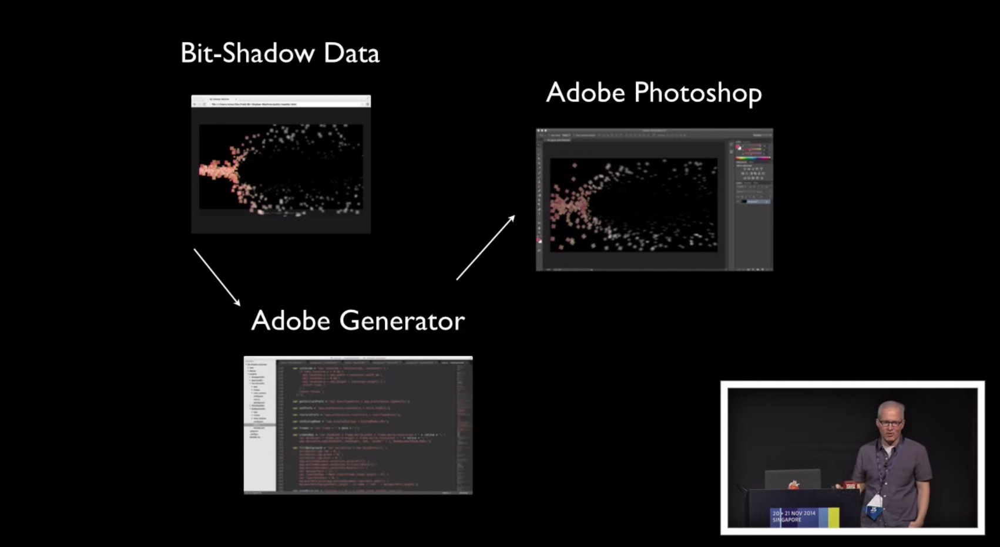

I recently came across the 2014's JSConf.asia videos on YouTube and found two remarkable presentation that only very few people started to talk about on Twitter or in Meetups. Both talks deal with different ways of simulating 'worlds' in JavaScript and involve interesting rendering techniques, useful algorithms and beautiful visualizations. First I will show Simon Swain's ([@simon_swain](https://twitter.com/simon_swain)) talk about Deep Space simulations ([YouTube](https://www.youtube.com/watch?v=0HJPilemNns)) and then Vince Allen's ([@vinceallenvince](https://twitter.com/vinceallenvince)) talk about Pixel Art and complex systems ([YouTube](https://www.youtube.com/watch?v=mrxsD0mCpZ4)). I encourage you to watch both videos after reading this post because for the sake of simplicity I had to leave out tons of stuff such as Vince's art background.

## Deep Space

Simon Swain starts his talk off with an example implementation of [Conway's Game of Life](http://en.wikipedia.org/wiki/Conway%27s_Game_of_Life) which is a simulation of 'cells'. In each cycle a cell either dies, is born or lives based on four rules which depend on the neighboring cells. This system looks rather uncomplicated but it can create complex structures of cells that form bigger cell mechanisms which move across the field as a whole. Like for many people that studied CS, Game of Life was probably one of the first assignments in university and it is great to see the beauty of Simon's visualizations, whereas I for example only built a version of Life that ran in the console. I especially liked his variation of Life which includes rabbit and wolf cells. When Swain adds the ability for rabbits to breed and for wolves to kill rabbits, the occurring populations of animals are similar to the populations in biological systems.

<video controls loop>
  <source src="gol.webm" type="video/webm" />
</video>

Simon goes on by showing a custom economy simulation which is based upon four main properties: population, agriculture, industry and pollution. They all influence each other and those dependencies are created in a way so that, even if they influence each other in a bad way, after a certain amount of time a balance is recreated. In addition to an economy simulation Simon then adds the ability to create imaginary space ships which fly a certain amount of the population to a new world.

<video controls loop>
  <source src="economy.webm" type="video/webm" />
</video>

After introducing his basic render-loop, Simon introduces the concept of [Boids](http://en.wikipedia.org/wiki/Boids). Boids were created to simulate the moving behavior of animals that travel in flocks. Each object moves depending on three main concepts which involves looking at the position at other Boids in a flock. In this way, a very natural flocking and moving behavior can be achieved. The resulting flock movement looks astonishing and bears a resemblance to a shark swimming in the ocean.

<video controls loop>
  <source src="boids.webm" type="video/webm" />
</video>

But Simon's goal is not to recreate the biologically correct behavior of animals. He creates space ships from boids that have the ability to fight with other space ships. In addition to that he adds the economy simulation so that in combination he has planets of different parties that are able to create spaceships and to populate planets around their home planet. Unless those planets are guarded by other space ships. In this case they have to fight their enemies. Again: each planet in the animation below is running it's own economy!

<video controls loop>
  <source src="spaceships.webm" type="video/webm" />
</video>

The natural evolution of this system is, of course, hyperspace travel! Simon creates seven of the systems like seen above and lets three parties start in a different system simultaneously. When a party has created enough resources it can send populations to other systems to grow across solar systems. This leads to very interesting interaction between parties and simulations can last for several minutes until one party dominates all others.

<video controls loop>
  <source src="hyperspace.webm" type="video/webm" />
</video>

You can play around with Simon's space simulation [here](http://simonswain.com/deepspace/). It surely is great fun to see this war of the worlds play out in a browser!

## Complex Systems

[[slides](http://vinceallenvince.github.io/jsasia2014/), [demos](http://vinceallenvince.github.io/jsasia2014/)]

Vince Allen started his talk by introducing the audience to a very unique technique to render pixels onto a website. A technique which doesn't make use of canvas, images or SVG. He uses a `single DIV element` to program very complex animations by manipulating the element's `box-shadow` property [(7:17) "bit-shadow machine"](https://www.youtube.com/watch?v=mrxsD0mCpZ4#t=437). A box shadow can be manipulated in a way so that it has the `shape of a square` at an arbitrary position with arbitrary properties such as color and blur. In addition to that, DIV elements can have an arbitrary amount of box-shadow declarations which allows to display several squares on a webpage although the page's body only contains one DIV element.

Vince doesn't stop there and uses this rendering technique to visualize various simulations he created.

The first one is a simulation of a tornado [(12:23)](https://www.youtube.com/watch?v=mrxsD0mCpZ4#t=743) that he creates from very simple core elements such as a base and a spine. The tornado's movement and the spine are both generated from the [Perlin noise](http://en.wikipedia.org/wiki/Perlin_noise) algorithm which creates 'natural' random values. Different variations of the simulation show how a very natural effect and truly beautiful visualizations can result from a simple rendering technique and a simple random number generator.

<video controls loop>
  <source src="tornado.webm" type="video/webm" />
</video>

Vince then shows two more demos: an alternative version of the sheep vs. wolf simulation [(22:21)](https://www.youtube.com/watch?v=mrxsD0mCpZ4#t=1341) which Simon showed as well and a termite simulation [(27:12)](https://www.youtube.com/watch?v=mrxsD0mCpZ4#t=1632). Both of them are based on the concept of [Braitenberg vehicles](http://en.wikipedia.org/wiki/Braitenberg_vehicle), 'vehicles' that only consist of a sensor and a motor. Stimulation of the sensor (or alternatively the sensors) leads to a reaction of the motor. The resulting new position towards other objects then creates a new stimulation of the sensor which will again create a reaction of the motor. These two elementary concepts lead in interesting visualizations. Especially when the sheep/wolf demo is enhanced by another entity, Zombies [(23:55)](https://www.youtube.com/watch?v=mrxsD0mCpZ4#t=1435):

<video controls loop>
  <source src="wolvessheepzombies.webm" type="video/webm" />
</video>

Just as a reminder: The demos above are also rendered as multiple box-shadows of only a single div element.

Another outstanding element of Vince's talk is that he uses Photoshop to render videos of his simulations. In this way he can create HD-quality videos with realistic motion blur and shallow depth of field. He uses node.js to feed Adobe Generator with positional data from each frame of the visualization. Adobe Generator then creates high-resolution Photoshop images from that data. Those images can then be concatenated into a video [(17:14)](https://www.youtube.com/watch?v=mrxsD0mCpZ4#t=1034). Oh, and did I mention that he uses the Web Audio API for atmospheric background noise generation? ;) His noise library is called Soundbed and can be found on [Github](https://github.com/vinceallenvince/soundbed).

Both talks show that it can be really fun to work on algorithms and to visualize the results. In their cases, they created systems with agents which were acting based on simple rules. The visualizations of these systems can be mesmerizing for example when the sheep/wolves/zombies system creates a state of equilibrium [(26:13, Vince)](https://www.youtube.com/watch?v=mrxsD0mCpZ4#t=1563) or when introducing hyperspace travel to the deep space simulation which results in a minutes-long fight over solar systems [(23:41, Simon)](https://www.youtube.com/watch?v=0HJPilemNns#t=1421). Changes in those systems result in an immediate, sometimes very artistic, change in visualization and behavior.

I hope we will see more simulations like these in the future. With people like Vince and Simon talking at various JS conferences all over the world I'm confident that we will see more of it very soon :)
