This blog used to have comments. There was a time when you could find a comment form under each post. The form was provided through a third-party embed of course, since this is a static site. There is no server or no database that could hold on to your comments.

After a couple of years I decided to remove the comment form since it wasn't really used and most discussions happened on social media anyways. Sadly there was no (sensible / easy) way to bring those discussion here without embedding tons of external code.

But when I was reading [Sophie's](https://localghost.dev/blog/2022-the-year-in-lists/) and [Andy's](https://andy-bell.co.uk/wrapping-up-2022/) blog posts, I noticed that they contained comments and likes from social media sites without a third-party embed. So I went on a journey to understand how that integration works and how to bring it to my own blog as well.

## What are webmentions?

These blogs are using [webmentions](https://en.wikipedia.org/wiki/Webmention) to gather mentions/likes/reposts from all over the internet. Webmentions are a (recommended) standard that allows sites to notify other sites that they're linking to them.

<div style="width: 60%; margin: 0 auto;">


</div>

The way this works is that site A defines a `webmention` API endpoint as a `<link />` and site B, e.g. when a new blog post is created, looks at its external links, checks if they support webmentions and when they do, calls their webmention endpoint. That call contains the source of the link and the type of that link amongst more metadata like the date (types will be explained later).

Webmentions are a great system, but they do not really work for static sites like this one. There is no server, so no webmention endpoint. Luckily, there are services that will collect webmentions on your behalf so you can fetch them later on. One of those services is [webmention.io](https://webmention.io).

### webmention.io

After signing up on the site, it provides you with a webmention endpoint that you can add to your site:

```html
<link
  rel="webmention"
  href="https://webmention.io/janmonschke.com/webmention"
/>
```

Add that to your site's `<head/>` and other sites can immediately start sending mentions of your site to webmention.io.


The collected webmentions can be queried through webmention.io's API. And when there's an API, there's a way to embed those mentions onto my blog. That's great!

But! _There had to be a but, of course._

My initial problem was that discussions were happening on social media. Social media sites do sadly not send webmentions. Neither Twitter, nor Mastodon[^1]. So how do the sites mentioned above get their likes and mentions from social media?

### brid.gy

Of course there is another service that solves this problem: [brid.gy](https://brid.gy/)


Brid.gy connects mentions, likes, reposts etc. from social media sites to your site. It basically works as an automated social media search for mentions for your site and it then converts those mentions / reactions into webmentions.

<div style="width: 60%; margin: 0 auto;">


</div>

Even better, brid.gy also acts as webmention "notifier" for your site. It periodically crawls your site for mentions of other sites and it will then create webmentions for those sites. It's such a helpful service. This allows static sites to act like proper players in the webmention/indieweb game.

A final cool feature, and I promise I will then stop praising brid.gy so much. Brid.gy can also scan your old social media posts and create mentions for those. Meaning you can collect likes as webmentions from previously when you weren't using brid.gy and webmention.io yet. Backfeeding of mentions is limited to likes and reposts though[^2].

## Bringing webmentions to your static site

Now, how are we going to bring webmentions to our static site? There are two ways of how to use webmentions in your static site that I will explain in this post.

The first one is the simplest one and, apart from setting up webmention.io and brid.gy, requires pretty much no extra setup. The second one is a bit more involved and requires GitHub actions, a proper integration into Gatsby's GraphQL layer and, optionally, setting up a webhook for your Github actions (most of that flow will also work for other static site generators).

The first approach is perfect for your if you quickly want to see how webmentions will look like on your site. However, I recommend going with the second approach (if possible). It has the advantage of owning your mentions. It's more resilient to outages and shutdowns of the third-party sites you rely on and your site will load faster. It is also more flexible, as we'll see later on.

### Fetching webmentions on-demand

The simplest way to show webmentions is to fetch them on the client-side from webmention.io.

```javascript
function Webmentions({ postUrl }) {
  const [mentions, setMentions] = useState(null);

  useEffect(() => {
    fetch("https://webmention.io/api/mentions.jf2?target=" + postUrl)
      .then((response) => response.json())
      .then((mentionsJson) => setMentions(mentionsJson.children));
  }, []);

  if (!mentions || mentions.length === 0) {
    return null;
  }

  return (
    <aside>
      <ul>
        {mentions
          .filter((wm) =>
            ["in-reply-to", "mention-of"].includes(wm["wm-property"])
          )
          .map((mention) => (
            <li key={mention.id}>
              @{mention.author.name}: {mention.content.text}
            </li>
          ))}
      </ul>
    </aside>
  );
}
```

This piece of code[^3] will render a list of all webmentions for the given post on your site. Each mention will contain the user's name and their message like so:

_@Jeremy: I found this really cool blog post by Ada adas.site/webmentions-explained_

The webmention object has a lot more properties that we are not using in this example but you might want to check them out for your use-case (e.g. a link back to the author at `author.url`, the author's profile pic `author.photo` or a link back to the original post `mention.url`).

This component can be placed anywhere on a blog post or any other site. Its only parameter is `postUrl` which is the public url of the page you want to fetch webmentions for (e.g. `https://adas.site/webmentions-explained/`). This url is the one that you or other users post on social media or their webmention-enabled blog. **Brid.gy** and **webmention.io** will use that public url to send and store your mentions.

If we have another look at where the code iterates over the mentions, you'll find that we are filtering the mentions based on their `wm-property`.

```javascript
mentions.filter((wm) =>
  ["in-reply-to", "mention-of"].includes(wm["wm-property"])
);
```

We are doing this in order to only show replies or mentions of our post. Other types of webmentions do not include `content`, so the code above would not work. Other types include `like-of` for likes of your post and `repost-of` for reposts of your post. A full list of the supported values of `wm-property` can be found in the [webmention.io documention](https://github.com/aaronpk/webmention.io#find-links-of-a-specific-type-to-a-specific-page).

It is generally a good idea to group webmentions by type and show them in distinct lists. For example a simpler list of likes and more complex list for actuall mentions with content. But feel free to integrate all types in the same list. There are no rules and the world is your oyster!

This approach is pretty simple but has some disadvantages:

- It makes an extra request for each user visiting the page
- When webmention.io is down, your mentions (and likes etc.) won't load
- In case webmention.io shuts down, you lose all your webmentions

### Owning your webmentions and building them statically

The approach that I took for webmentions on this site makes sure that webmentions are checked into GitHub. This makes them resilient to issues with third-party webmention providers and it allows to build them statically. Meaning we don't need to make an additional request, yay 🎉

> This approach is influenced by [Sebastian De Deyne's webmention integration](https://sebastiandedeyne.com/webmentions-on-a-static-site-with-github-actions/). Instead of integrating webmentions into Hugo, I'm explaining here how to integrate them into Gatsby. There are already Gatsby plugins for webmentions but they load them dynamically and not statically.

#### Synchronizing webmentions into your GitHub repository

Similarly to the first approach, we need to fetch webmentions from webmention.io. This time however, we are going to sync all mentions for our domain, instead of mentions per post/site. We could do it per post, but I find Sebastian's solution quite elegant, so we'll stick to it.

The synchronization works like this:

1. Fetch all mentions for our domain (in my case https://janmonschke.com)
2. For each webmention, we will read out it's `wm-target` property
3. Check in `./webmentions/data/` if we already have a JSON webmention file for that post (e.g. `webmentions-explained.json`)
4. If the file exists, then merge the new mention into that file
   1. Make sure to exclude duplicates by comparing the `wm-id` property 🔎
   2. Sort mentions by `wm-id` to keep a roughly correct order in the cache file. The actual order for mentions will be based on the `published` property later on. However, likes and reposts don't have this property, so `wm-id` is the best we can do at this point. ✅
   3. Write the file to disk 🎉
5. If the file does not exist, create a new cache file for this post which only contains this webmention: `[webmention]` 🎉

You can check out the code below or directly in my [site's GitHub repo](https://github.com/janmonschke/janmonschke.github.com/blob/dev/webmentions/sync.js).

<iframe
src="https://gist.github.com/janmonschke/49d354bc96393348a9037dba0018fa6b.pibb"
style="width: 100%; height: 300px; border: 0;margin-top: -1.5em;"
title="Embedded code from GitHub">
</iframe>

I found that a good directory for the JSON files is `./webmentions/data` since my sync script lives in `./webmentions/sync.js`. First I tried to co-locate blog posts and their webmentions cache in the same but it turned out to be quite complicated to find the correct directory based on the `wm-target` property. I could parse those urls and then also parse all my post's frontmatter to try and match them but there is an easier way to associate mentions and posts and that is GraphQL.

One optimization for the synchronization flow is to not always fetch all webmentions. If you regularly sync your mentions, you can use the `since` parameter in the webmention.io API in order to limit the timeframe for new mentions.

#### Sourcing webmentions into Gatsby's GraphQL layer

Now that we have the mentions in our repository, we want to tell Gatsby to ingest them so we can query them via GraphQL. For that we need to install [gatsby-transformer-json](https://github.com/gatsbyjs/gatsby/tree/master/packages/gatsby-transformer-json#readme) and [gatsby-source-filesystem](https://github.com/gatsbyjs/gatsby/tree/master/packages/gatsby-source-filesystem#readme).

In the `gatsby-config.js` we then set up the plugins like this:

```javascript
plugins: [
  {
    resolve: `gatsby-transformer-json`,
    options: {
      typeName: `webmentions`,
    },
  },
  {
    resolve: `gatsby-source-filesystem`,
    options: {
      path: `${__dirname}/webmentions/data`,
    },
  },
];
```

`gatsby-source-filesystem` tells Gatsby to source files from `${__dirname}/webmentions/data` and `gatsby-transformer-json` parses the JSON content from those files and makes the webmentions available via GraphQL.

In GraphiQL, we now have access to a new entry for `allWebmentions` which contains the content of all the sourced JSON files.

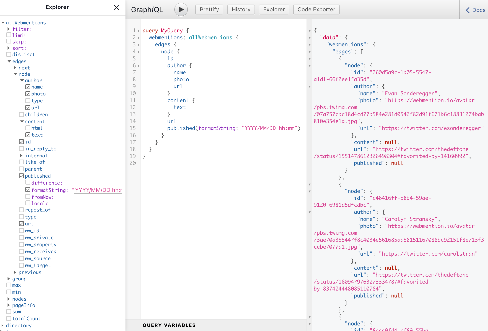

If we wanted to fetch all webmentions of our site, we could use the following query:

```graphql
query Webmentions {
  allWebmentions {
    edges {
      node {
        id
        author {
          name
          photo
          url
        }
        content {
          text
        }
        url
        published(formatString: "YYYY/MM/DD hh:mm")
      }
    }
  }
}
```

This would return information on each webmention's user, it's content, the url it came from and the date it was published at. The JSON transformer even managed to deduct the correct type for the `published` field. Since it detected a `Date` type, we can use the `formatString` transform to get a preformatted date string 📆.

#### Querying and displaying webmentions for your blog post

It's nice to have all webmentions for our site, but a more practical query is to ask for mentions of a specific post on our site. For that, we'll filter webmentions by their `wm_target` property. `wm_target` is the public url of the post.

```graphql
query Webmentions {
  allWebmentions(
    filter: {
      wm_target: { eq: $publicUrl }
    }
    sort: {
      fields: published, order: ASC
    }
  ) {
  (...)
  }
}
```

At the same time, we can also use the `published` property to sort the posts by their publishing date. The `$publicUrl` variable we can pass to Gatsby's `createPage` function like this:

```javascript
const { slug } = post.node.fields;
createPage({
  path: slug,
  component: blogPost,
  context: {
    publicUrl: ensureTrailingSlash(YOUR_DOMAIN + slug),
  },
});
```

I noticed that all `wm_target` values have a trainling slash, but only some of the `slug`s did, so I made a little helper function (`ensureTrailingSlash`) that appends a slash in case the slug doesn't have one.

Now there is only one more filter missing. If you've read the first part about fetching webmentions dynamically, you might remember that we're now also receiving like- and repost-mentions of our post. Those lack some properties such as `content` and `published` which is why we filtered them out previously. We can achieve the same thing in GraphQL:

```graphql
query Webmentions($publicUrl: String!) {
  webmentions: allWebmentions(
    filter: {
      wm_property: { in: ["in-reply-to", "mention-of"] }
      wm_target: { eq: $publicUrl }
    }
    sort: { fields: published, order: ASC }
  ) {
    (...)
  }
}
```

This will only return replies and mentions of our post and it will allow us to display a list of webmentions. On my blog, I'm rendering the webmentions like this:

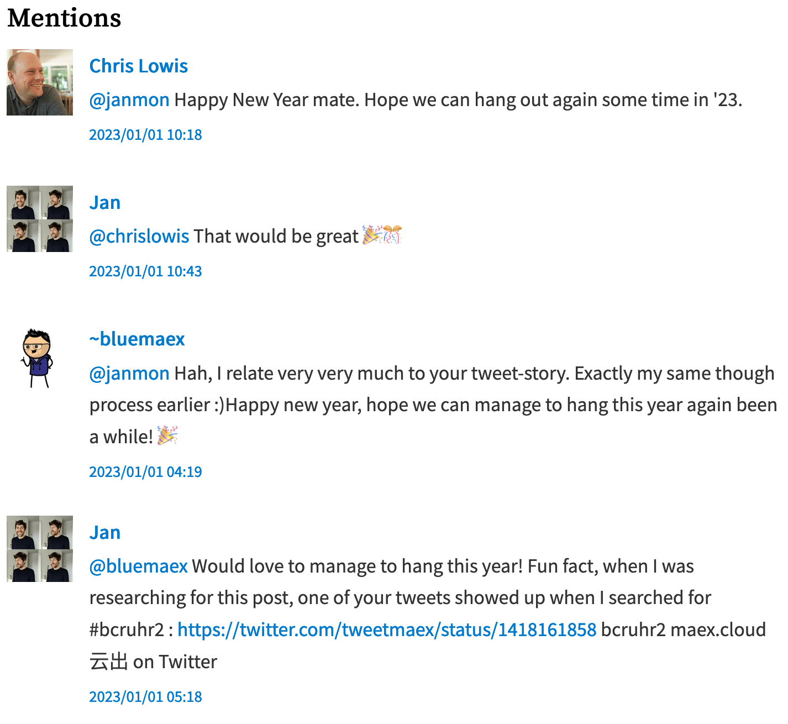

As an example, check out how I'm rendering mentions on my site: [Mentions.js](https://github.com/janmonschke/janmonschke.github.com/blob/4413146f9d5b9ebfe73f2b7d4b9aeae0ff2e7349/src/components/Mentions.js).

If you want to show likes and reposts of your posts as well, you can use the following query to also select those:

```graphql
query Webmentions($publicUrl: String!) {
  likes: allWebmentions(
    filter: {
      wm_property: { eq: "like-of" },
      wm_target: { eq: $publicUrl }
    }
  ) {
    (...)
  }
  reposts: allWebmentions(
    filter: {
      wm_property: { eq: "repost-of" },
      wm_target: { eq: $publicUrl }
    }
  ) {
    (...)
  }
}
```

And then you can display them in your blog post as well.


This is the code I use for my likes for example: [Likes.ts](https://github.com/janmonschke/janmonschke.github.com/blob/4413146f9d5b9ebfe73f2b7d4b9aeae0ff2e7349/src/components/Likes.js). I haven't really felt the need yet to show reposts as well.

#### Sanitizing the external html content

Let's have a last look at the `content` of a webmention. In the previous examples, I only queried for `content.text` which does not actually contain links to profiles but only a raw text representation of a webmention. That means @mentions in the content are neither highlighted, nor are they interactive.

There is a `content.html` version that does contain links to profiles and proper `<a/>` tags for external links. However, it also contains more unwanted HTML like `<p/>` tags around the text. More importantly, the HTML could potentially contain harmful elements (think: script injection).

Just showing the raw text was not an option for me, neither was embedding the external HTML. So I decided to parse `content.html` for links to profiles and other resources. And then use that information to enrich the raw text from `content.text`.

First, we're parsing the HTML for @mentions and their links:

```javascript
const atMentionUrlRegex = /<a href="([http].+?)".+?class=\"u-url\">(.*?)<\/a>/g;

// Create a lookup for @mention links e.g.:
// { "@janmon": "https://social.lol/janmon" }
const atMentionsUrls = [...html.matchAll(atMentionUrlRegex)].reduce(
  (_atMentions, [_, userUrl, userAtMention]) => {
    _atMentions[userAtMention.replace("<span>", "").replace("</span>", "")] =
      userUrl;
    return _atMentions;
  },
  {}
);
```

This will allow us to replace raw @mentions e.g. `@janmon` with proper `<a/>` tags in the next step.

```javascript
const atMentionRegex = /(@\w+)/g;
const urlRegex = /(https|http):\/\/\S+/g;

const enhancedText = text
  // Replace all @mentions with links nofollow + ugc links that were parsed before
  .replace(atMentionRegex, (atMention) => {
    return `<a href="${atMentionsUrls[atMention]}" rel="nofollow ugc" target="_blank">${atMention}</a>`;
  })
  // Replace all urls in the text with nofollow + ugc links
  .replace(urlRegex, (url) => {
    return `<a href="${url}" rel="nofollow ugc" target="_blank">${url}</a>`;
  });
```

In the first step, we're using a regular expression that matches @mentions to replace the mention with a normal link. I also decided to add [rel="nofollow ugc"](http://developer.mozilla.org/docs/Web/HTML/Link_types) to the link since they are indeed user-generated and I do not have control over to where they link to.

In the second step, we're replacing raw urls (identified by starting with either `http` or `https`) with regular link tags as well. Same procedure, really.

The resulting text feels "safe" enough for me to then render it in a `dangerouslySetInnerHTML` 😅. This allows me to render webmentions with interactive @mentions and links 🎉 [^4].

The actual code on my site contains some more documentation around the expected shape of the HTML content. Check out my [Mentions component](https://github.com/janmonschke/janmonschke.github.com/blob/4413146f9d5b9ebfe73f2b7d4b9aeae0ff2e7349/src/components/Mentions.js#L46-L102) if you want to dive deeper into this function.

### Automating the webmention synchronisation

The final bit of the webmention integration is to automate the entire process. If you're okay with running the script yourself every now and then that is also totally fine. The automation is totally optional.

Since I'm using GitHub to host my blog and its code, I'm also using GitHub actions to automate fetching webmentions. Prior knowledge with GitHub actions is not required for this step of the process. I'm giving a basic description of most of the instructions but am not going into a lot of detail.

The game plan for the automation is to be able to run the synchronization periodically, in response to a webhook from webmention.io and when triggered manually (which is useful for debugging).

As before, I'm using [Sebastian's setup](https://sebastiandedeyne.com/webmentions-on-a-static-site-with-github-actions/) as the base for my own integration.

Let's go ahead and create a new workflow file in `.github/workflows`. Let's call it `webmention-sync.yml`.

```yml
name: Webmentions Sync

on:
  schedule:
    - cron: "0 */24 * * *"
  workflow_dispatch:

jobs:
  webmentions-sync:
```

This part of the workflow file defines our new workflow `Webmentions Sync` wich will run periodically every 24 hours at midnight (`cron`) and it has a manual trigger in the GitHub UI (`workflow_dispatch`). The actual instructions it will execute are defined in the `jobs` section. Since we only run one job that is made of several steps, we're only using one top level key here `webmentions-sync`.

```yml
jobs:
  webmentions-sync:
    runs-on: ubuntu-latest
    steps:
      - name: Check out repository
        uses: actions/checkout@v3
        with:
          ref: dev
          token: ${{ secrets.GH_PAGES_ACCESS_TOKEN }}
      - name: Sync webmentions
        env:
          WEBMENTIONS_IO_TOKEN: ${{ secrets.WEBMENTIONS_IO_TOKEN }}
        run: node ./webmentions/sync.js
      - name: Commit to repository
        env:
          COMMIT_MSG: |
            Sync webmentions
        run: |
          git config user.email "YOUR_GITHUB_EMAIL"
          git config user.name "THE_NAME_YOU_WANT_TO_ASSOCIATE_TO_THE_COMMIT"
          git add .
          git diff --quiet && git diff --staged --quiet || (git commit -m "${COMMIT_MSG}"; git push origin dev)
```

In the first step we're using the `actions/checkout` action to check out the current repository on the CI. This is an external action that is provided by GitHub. We're checking out the `dev` branch and passing a custom `token`. `secrets.GH_PAGES_ACCESS_TOKEN` is a personal access token the script needs in order to commit to your repository with a token that is not the standard action token. Check out [this guide on how to create a token on GitHub](https://docs.github.com/en/authentication/keeping-your-account-and-data-secure/creating-a-personal-access-token). A different token is needed here since only a custom token will trigger the action workflow that will actually build the site[^5].

Next we're executing the actual synchonisation script with `run: node ./webmentions/sync.js`. Notice that we're also making the `WEBMENTIONS_IO_TOKEN` secret available as an environment variable. If you remember, the script needs that variable to make requests to webmention.io. The actual value of that variable is saved as an encrypted secret in our repository. Check out [this GitHub guide on how to add encrypted secrets to your repository](https://docs.github.com/en/actions/security-guides/encrypted-secrets).

At that point, the script will have fetched new webmentions and have written them to disk. Time to actually commit them to the repository. There is weirdly no reusabled action for this, so that step is just executing a couple of git commands. Also make sure to replace the committer's name and e-mail with your credentials so that the commit is associated to your account. The final command will push new mentions to your repository or do nothing if there were no changes.

Since I am depoying my site to GitHub pages with [another action workflow which is triggererd by pushes to `dev`](https://github.com/janmonschke/janmonschke.github.com/blob/dev/.github/workflows/gh-pages-deploy.yml), my site will automatically rebuild whenever there are new webmentions 🎉.

#### Using webhooks to sync webmentions on-demand

This step is also optional but I felt it was actually fun to implement. The webmention.io API has a feature where it calls a webhook when it has new webmentions for your site. This allows us to update webmentions whenever a new mention comes in (faster than just every 24 hours).

The webhook fits in beautifully into the GitHub action workflow because GitHub workflows can be triggered by calling a webhook. So in theory we could tell the webmention.io API to call our GitHub webhook directly. Which would then in turn start the webmention synchronization workflow.

There is only a tiny problem with that setup. The GitHub webhook needs to be called with specific headers. Those headers cannot be configured on webmention.io. In order to go around this issue, I decided to add a no-code tool in between those two entities.

I went with [pipedream.com](https://pipedream.com) because I struggled to set up a webhook from [ifttt.com](https://ifttt.com/) to GitHub and there is no way to inspect outgoing requests. It's possible to make this flow work with other no-code tools but since I'm already using pipedream for other automations, I opted for this one.

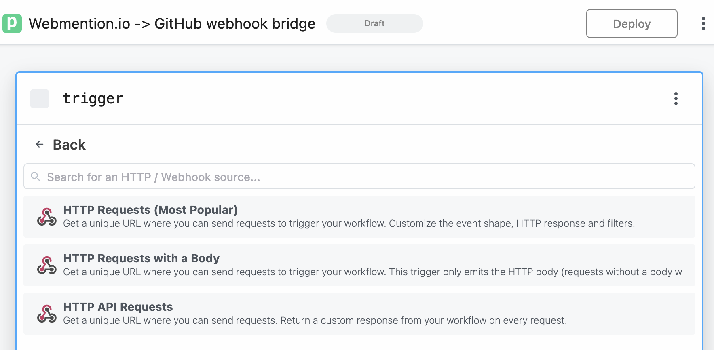

There is no special setup required for this trigger. We only need the url so we can add it to our webmention.io settings page.

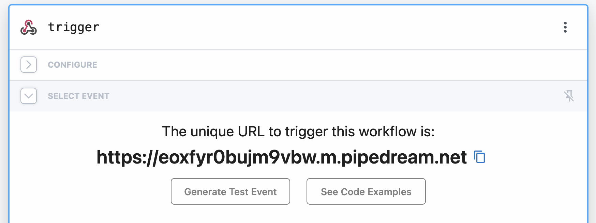

The trigger for our new pipedream workflow is an incoming HTTP request:

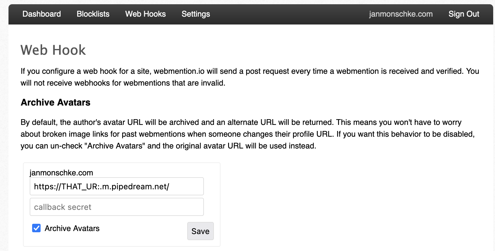

On the [webhooks settings page](https://webmention.io/settings/webhooks) you can then paste that URL and webmention.io will call it whenever there is a new webmention.

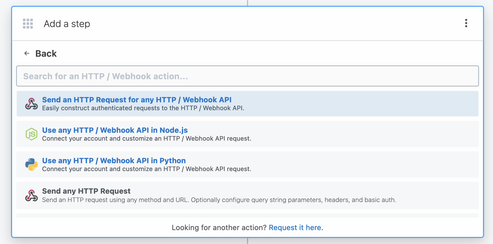

Back in our pipedream workflow, we can add a new HTTP request step:

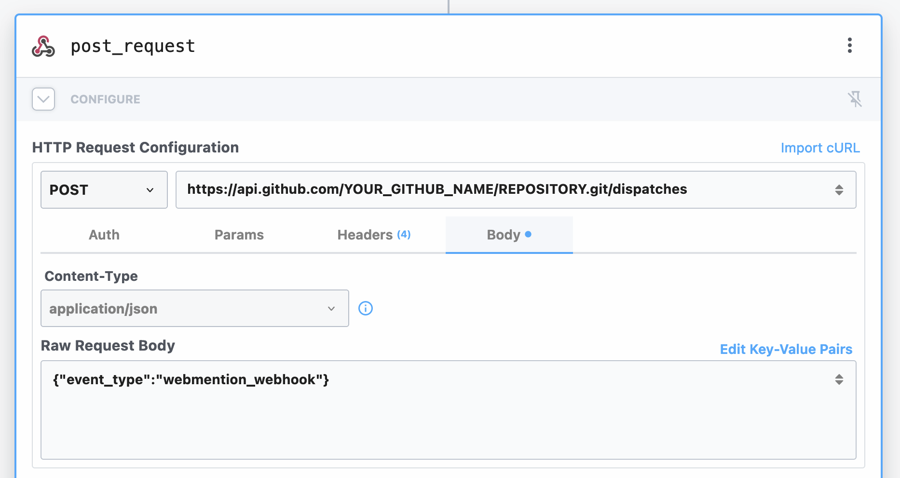

The request should go to `api.github.com/YOUR_NAME/REPOSITORY.git/dispatches` (obv. replace with your own repository) and as its body it should send a simple JSON object that describes the type of event (will explain later). In our case, I called the event `webmention_webhook`.

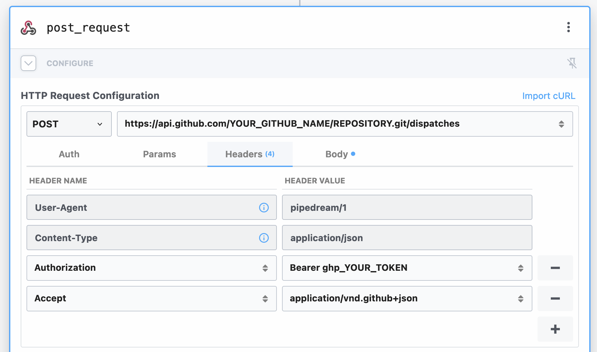

Next we add the required headers to the request. In `Authorization`, add your GitHub token (you can use the one we created earlier) and in `Accept` add `application/vnd.github+json`. This marks the workflow as complete and you can deploy it.

The only thing that's missing now is a change to our GitHub workflow. In our `on` list, we now add another entry `repository_dispatch`:

```yml
on:
  schedule:
    - cron: "0 */24 * * *"
  workflow_dispatch:

  # pipedream webhook
  repository_dispatch:
    types:
      - webmention_webhook
```

`repository_dispatch` enables webhooks for this workflow and `types: - webmention_webhook` sets up the flow to run on webhooks that have the event type `webmention_webhook` (which comes from the request body in our pipedream request).

And that's it. You can test out the whole flow by liking one of your toots / tweets that contain a URL to your own blog. Once brid.gy picks up the like (you can make it rescan that toot-/tweet-url) you should see that your GitHub workflow was triggered and your site is built again 🎉

That's really it.

Unless.

Well, in the rare case where you will have lots of likes, mentions and reposts for a blog post, you will now trigger a new pipeline run for every one of those webhook calls. This could result in git conflicts on the pipeline. Which in turn will potentially block the pipeline. It's also not necessary to build your site 10 times within a minute. You can prevent multiple pipeline runs by adding the following to your workflow file:

```yml
concurrency:
  group: webmention_sync
  cancel-in-progress: true
```

This will stop previous pipelines when a new pipeline run is triggered. No more parallel pipeline runs, no more conflicts, yay 🎉

This was really it, haha.

## The end (my friend)

I hope this helps you to set up webmentions on your site. This post did get a little longer than I hoped, and documenting the process took way longer than actually building the integration. That is to say, it might look complicated, but it's not as much work as it seems to be!

Let me know how it worked out for you on your site by replying to [this toot](https://social.lol/@janmon/109777627702072379) or [this tweet](https://twitter.com/thedeftone/status/1620004702632169473).

[^1]: Check out this discussion on why Mastodon doesn't currently support webmentions: https://github.com/mastodon/mastodon/issues/6074
[^2]: Brid.gy uses the standard Twitter search which does not return replies for tweets that are older than a couple of days: https://brid.gy/about#missing
[^3]: Yes, I know about the debate over fetching in `useEffect`. That's not the point of this example. I just wanted to provide a quick piece of code to showcase fetching webmentions on the client. 😅
[^4]: This approach of enriching the text might not be 100% secure itself and it relies on the fact that `content.text` does not contain any HTML tags.
[^5]: This discussion on GitHub shines some light on why another token is required: https://github.com/community/community/discussions/37103
