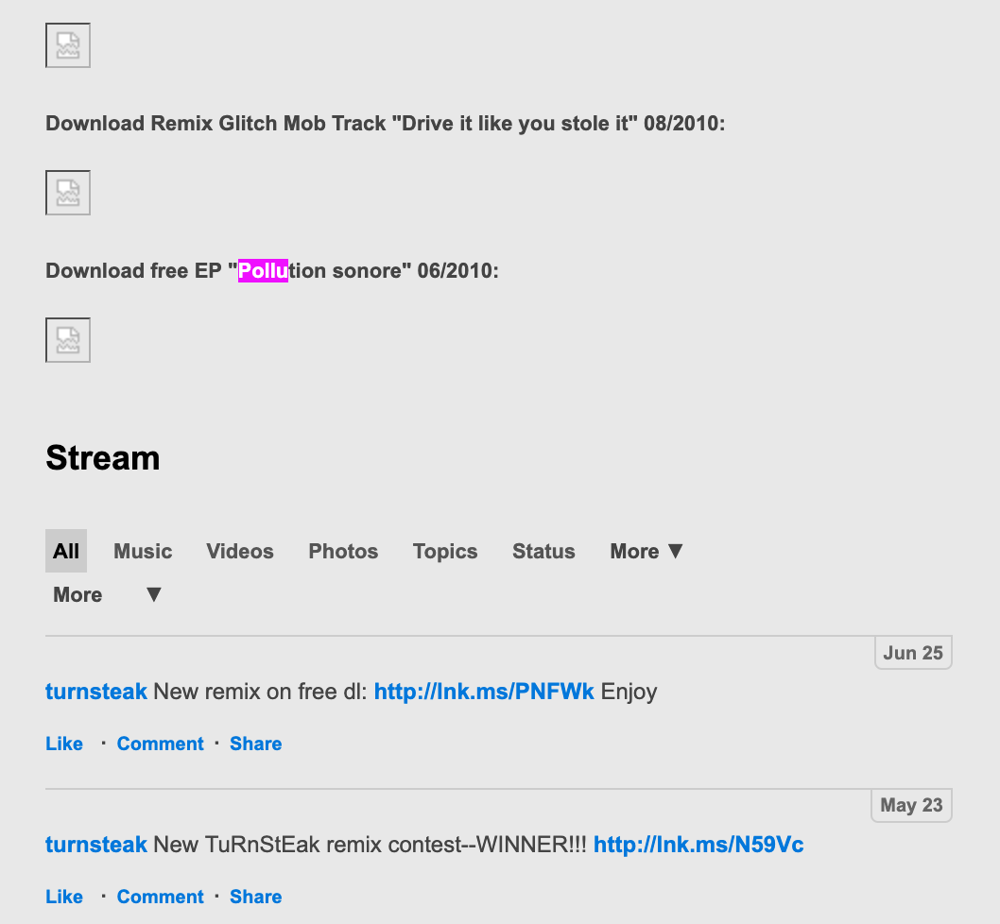
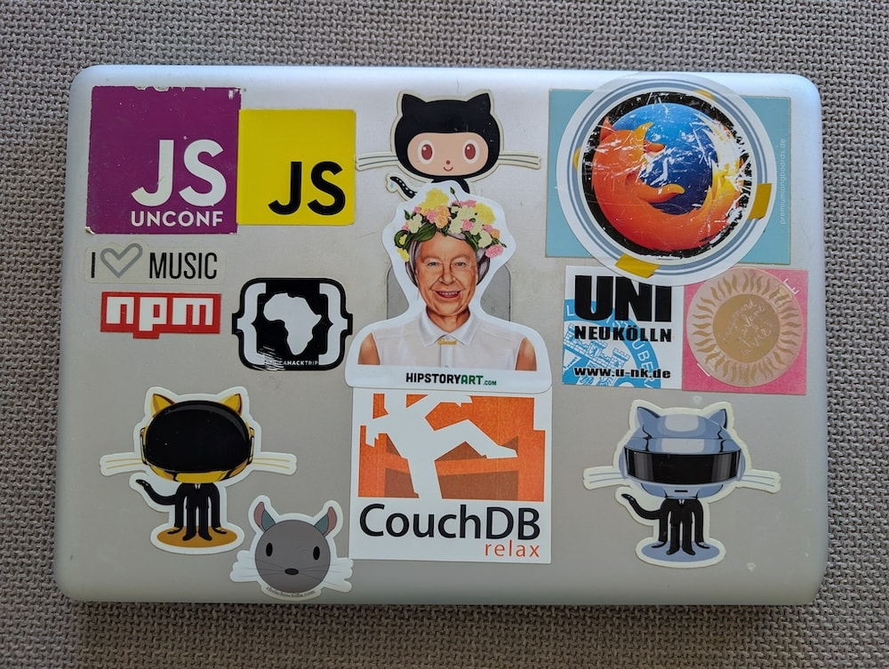
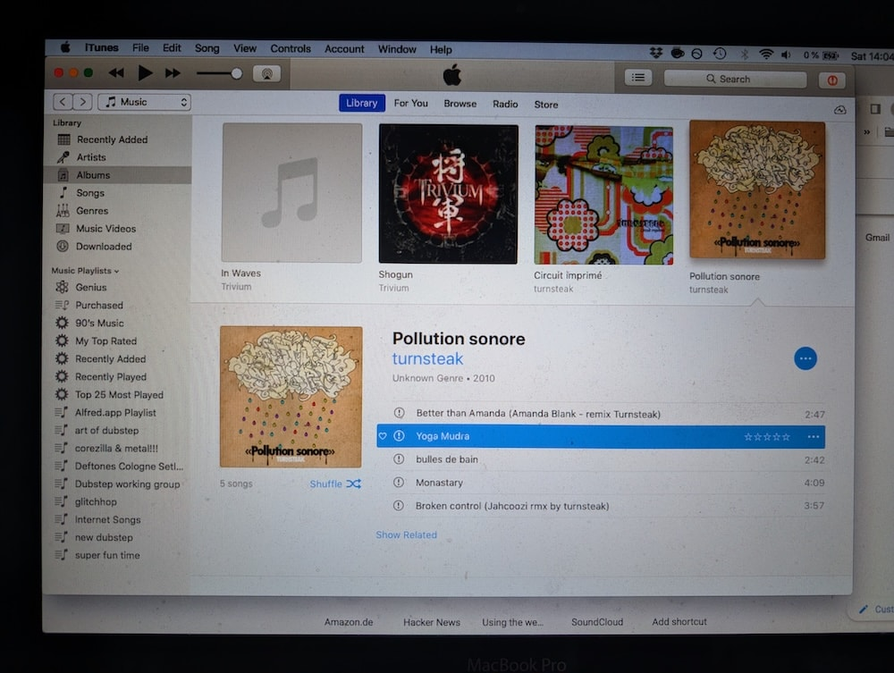
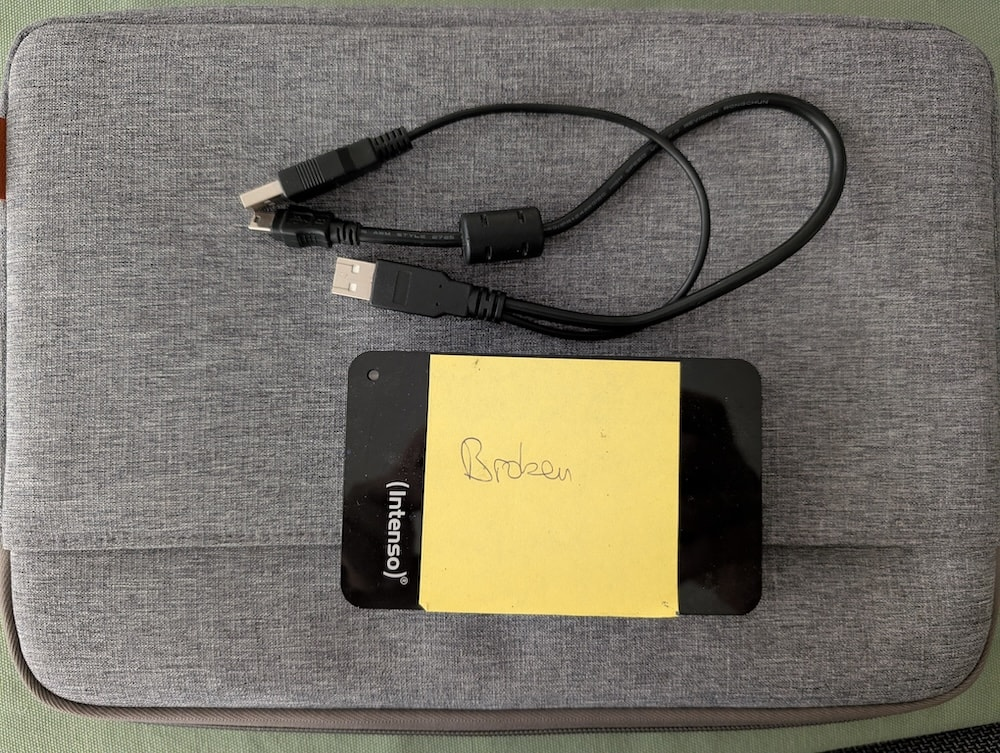
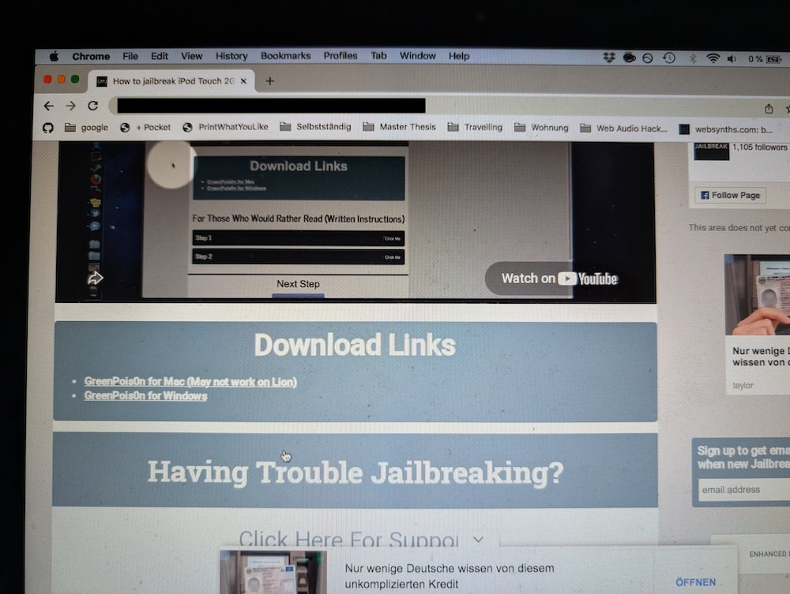
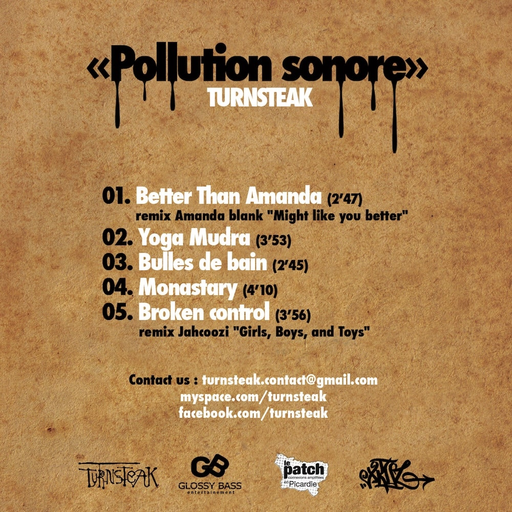

This is a story about music, backups, nostalgia and, I guess, the iPod touch.

## How it started
For the last weeks I've been doing, what I call, *music archaeology*. It started with another Bandcamp Friday[^bandcampfriday]. I was perusing my music library and for the first time in a long time, I scrolled all the way down. There it was, Circuit imprimé by [Turnsteak](https://turnsteak.bandcamp.com/) [^circuitimprime], this album that I had long forgotten about, my very first bandcamp purchase from all the way back in **2010**. My second purchase was 5 years after that in 2015.

I was immediately struck with a deep feeling of nostalgia. When I bought this album I was writing my bachelor's thesis and working and studying in parallel. 2010 was the year that The Glitch Mob released [Drink the Sea](https://en.wikipedia.org/wiki/Drink_the_Sea). An album that started a whole extension to my musical taste. I listened to it non-stop and my nightly MySpace crawls included more and more "glitchy" artists.

It was on one of those crawls that I came along artists such as [Broken Haze](https://brokenhaze.bandcamp.com/) from Japan and bespoke [Turnsteak](https://turnsteak.bandcamp.com/) from France. [Broken Haze's album "raid system"](https://brokenhazejp.bandcamp.com/album/raid-system) (especially the track "rebuild") and Turnsteak's EP "pollution sonore" (especially "Yoga mudra") were my favorites.

You might wonder, why did I not link to the "pollution sonore" EP above? It's because I could not find it **anywhere** (on the internet). And that's how my archaeology expedition began.

## MySpace
If my memory serves me well, the EP had never been available on Bandcamp. It must've been available on Turnsteak's MySpace page. A quick search in the internet archive [revealed an available snapshot from September 2011](https://web.archive.org/web/20110914065825/http://www.myspace.com/turnsteak) that mentions a free download link of the EP!

Of course that link has long been dead and "msplinks.com" links are not archived. Even if, I doubt they would have archived random zips of mp3s at that point. So MySpace was a dead end, I needed to look somewhere else.

## My first MacBook

2010 was also the year that I was able to afford my very first Macbook Pro. I remember that I got a hefty student discount and a **FREE** iPod touch on top. That MacBook still sits in my basement, untouched for many years now. If I had the album anywhere, it would be on that laptop. So I dug deep in my cable box for the correct charger and revived the Macbook's battery. Well, the battery is not charging anymore. The battery is pretty much dead but at least it's not swollen.

iTunes took 5 minutes to open up...and BOOM, there it was:

I connected my headphones, put up the volume, started the first track...and...nothing. What? I should've looked closer. The tracks in the album have a little exclamation mark in front. It means their metadata was found but not the actual mp3s. Now that was disappointing. It felt like the album cover on the screen was taunting me.

What happened to the files? It didn't take long for me to realize that I had deleted my music archive from the laptop when I gave it to my wife. But I'm not someone to just remove files, especially music archives. I must've saved them to one of my external hard disks.

## (not a) Backup
Once more I dug deep in my tech box in the basement and pulled out an external hard drive and some USB cables that seemed to fit. One thing was alarming though.

The hard drive had a "broken" post-it on it. Uh oh. Nevertheless, I connected the drive and the disk started spinning. The drive never mounted though. I'm no expert in disk recovery but it sounded like the only backup of my music collection is actually gone. Disk recovery services are quoting several hundred Euros for just an analysis without data recovery. That seemed like too much to potentially recover old music.

And yes, now's the time where everyone will scream that an external hard drive is no real backup. Yes, yes, I know. I've since learned my lesson and have been following the [3-2-1 backup strategy](https://www.backblaze.com/blog/the-3-2-1-backup-strategy/) for all important data.

At first this felt like the end of the investigation but then my eyes focused on the iPod touch in my tech box. What were the chances that the album was on that old iPod?
## How to destroy an iPod touch
I was lucky enough to find an old iPod cable (this is a 2nd gen iPod touch after all) and connected it to my Macbook Pro. I frantically searched through the library and there it was again, the album was on the iPod! But, how do you get your music off of an iPod touch? Unlike the iPod classic, the iPod touch doesn't mount as a regular hard drive. It uses some sort of proprietary protocol.

I tried out some open source applications ([iOpenPod](https://github.com/TheRealSavi/iOpenPod), [podkit](https://github.com/jvgomg/podkit)) but they don't support the iPod touch. A trial of a paid software also didn't work.

The only way to get to those files was to jailbreak the iPod touch and install an app to transfer the files. I had never jailbroken an iPod before and wasn't even sure you could still jailbreak a 2nd gen iPod touch today. Luckily I had my trusty old Macbook at hand. It was able to run the jailbreak tool. I will not link to the tool, if you want to find it, it's not too hard to find.

Long story short...it didn't work and it wiped my iPod touch. I'm not sure what went wrong. It might have been me pressing the buttons wrong, it might've been a bug in the tool. In any case, the files were gone and, this is becoming a recurring theme, I did not back up the iPod before attempting to jailbreak it....whyyyyyyy did I not back it up...

Again, I thought this had been the end. I had just deleted my only remaining copy of that EP.
## Why not ask the band?
Like seriously, why not just ask the band if they still have the EP? It turns out that I still had an email from **16 years** ago from when the band thanked me for buying one of their albums on bandcamp. Surely that email address is defunct by now, right?

I gave it a shot anyways and asked if they were able to still sell me the EP. Not expecting an answer I closed this chapter and was surprised to have an answer the **next day** including a link for a free download of the EP.

It's hard to describe how happy this made me. Listening to those glitchy tunes bubbled up so many memories from back when I was a working student. The music and the memories will be forever connected. Did the EP live up to my, at this point gigantic, expectations? Kind of. It's hard to say honestly. My music taste has changed a lot since then but that didn't prevent me from listening to the EP all day. 

## What did I learn?
- I should really work on my backup strategy. Since working on this post I have set up automated on- and offsite backups of my NAS. I spent the time foraging through old hard-drives for music and added them all to the backup.
- I finally downloaded all my music from Bandcamp so I don't run into the same situation again, should they ever shut down the site. In the process I also bought a bunch more albums that I usually stream from Qobuz.
- I learned that you can save a lot of time and nerves by asking humans first instead of going down the rabbit hole of reviving old hard drives and destroying an iPod touch.
## Bonus

While I cannot share the EP here, I want to share this live recording of Turnsteak's Japan tour in 2010: https://www.youtube.com/watch?v=xXGGxA7niVU. It's their song "Better than Amanda" from bespoke EP. 

<lite-youtube videoid="xXGGxA7niVU"></lite-youtube>

If you want to reach out to the band and get yourself a copy of the EP, you'll find their email address on the back cover of the EP:

[^bandcampfriday]: On Bandcamp Friday, Bandcamp waives the artist fees, so buying music on those days is even more beneficial for artists
[^circuitimprime]: The album has apparently been taken down/been privated by the artist and it only shows up for those who bought it.
