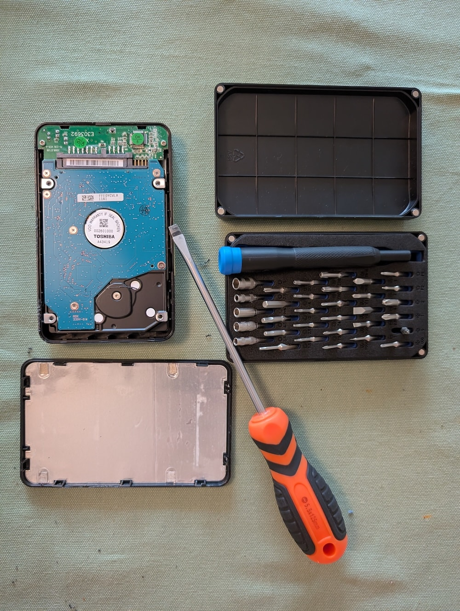
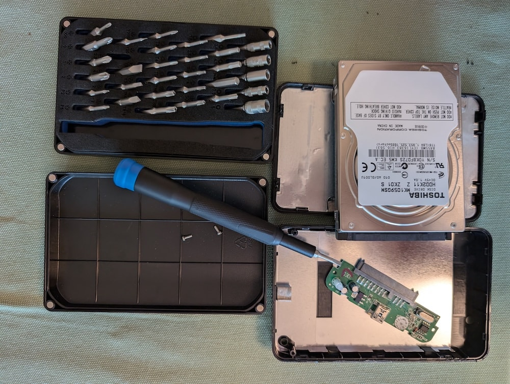
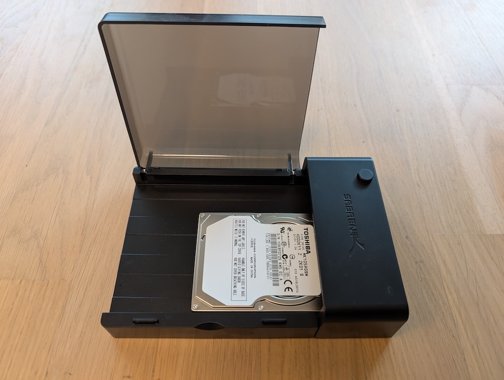
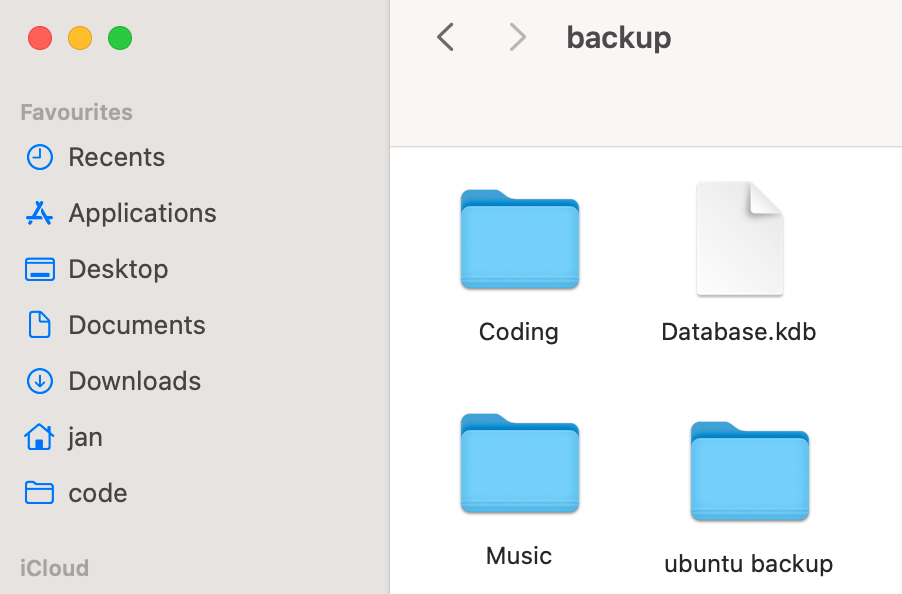
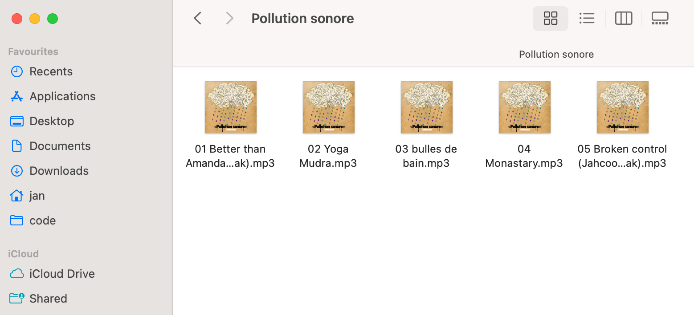
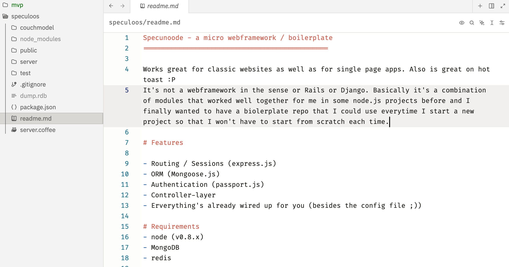

If you've read [my first post on music archaeology](/music-archaeology), you might already know that I had been searching for a very old digital EP release which I ultimately received by simply asking the band for a copy via email. However, it was a much more complicated journey than that.

Amongst other places, I searched for the EP on one of my oldest "backups". Due to a faulty hard drive, I wasn't able to restore my music collection. For a short moment I was considering to contact a professional data recovery service. When I ultimately saw their prices, that motivation vanished quickly.

A couple weeks after I finished writing the blog post, I came across [a YouTube account of a repair shop](https://www.youtube.com/@digitaldoctorrepairs/). In one episode, a client brought in a hard drive that wouldn't mount anymore. My eyes were immediately glued to the screen. The technician explained that there's little he could do in case the disks were damaged but that very often the issue was a faulty USB/SATA board. The fix is to open up the hard drive enclosure, disconnect the USB/SATA board and use another, external, SATA adapter to mount the hard drive.

I already had an external SATA adapter and so I got to fixing right away.

Tearing open the hard drive enclosure prove to be harder than I expected. I used a flathead screw driver to pry it open. It made some horrible cracking sounds but ultimately gave way and opened up. I wasn't afraid to break anything. In my mind, the hard drive was already broken anyways.

Then I unscrewed the USB/SATA board which came lose very easily.

Now, for the moment of truth: Would the hard drive mount with the help of the external SATA driver?

SUCCESS! It took quite a while to mount but there it was. My music backup, all my very old coding projects and a VERY ancient Ubuntu backup. And yes, the turnsteak EP was also part of that music backup

Amongst my coding backup I found this gem of a project. `Specunoode` was supposed to be a boilerplate repository that I could use for new nodejs projects. I don't think I ever published it and I remember bikeshedding this thing so much. Oh those were fun times.

And that's it, I finally have revived all of my old music library. There's more Dubstep in there than I remembered 🙈