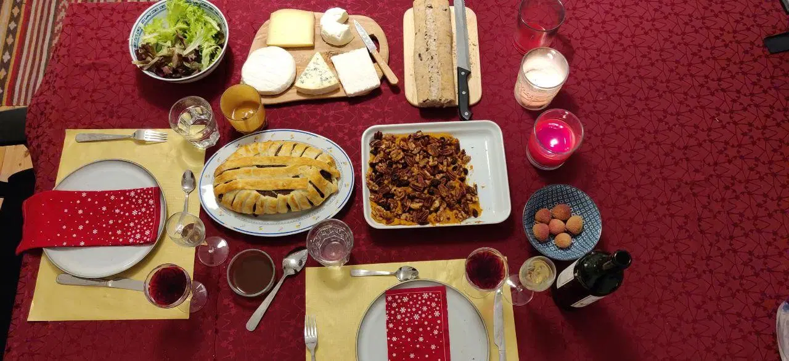

## Side Projects

### Ping

Made a lot of progress this week modeling a core user flow with [XState](https://xstate.js.org/). XState has become my go-to tool for modeling complex flows after great the experience I had using it for build [SoundCloud mastering](https://creators.soundcloud.com/mastering-on-soundcloud). The flow that I was working on in Ping involves checking browser support, sign-in state (with a separate machine that models sign-in/sign-up), checking resource access, before the user lands on the actual screen.

What I love about XState is that I can visualize the state machine on their [viz](https://xstate.js.org/viz/) page. It not only helps me to understand the flow better but it also allows me to simulate scenarios by interacting with the machine. It might look a bit messy at first, but in code it's a breeze to work with ❤️

Authentication was easy enough to set up with Firebase but it's not super straight forward to share the Firebase session with next.js so I think I will rely on the Firebase client for rendering 404s and such. There are a couple of solutions that I found that add the firebase auth token to a cookie which is then consumed by next to use for prefetching the data. However, that token times out after 10 minutes and the workraound of keeping that token up to date in an interval feels rather britle to me at this point. I will use that token for API-routes though because I can refresh it before the request to make sure it's valid.

## Life

We both back at work now after a two week stay-at-home vacation. Usually during the winter break we are visiting both our families which always makes for a very rewarding, but also stressful trip. It felt good to not have to rush through Europe and to take the time for the family in different ways. This year in lengthy video calls with televised gift giving and shared Christmas dinners. Everybody was eager to make the best of the situation and we even managed to get some more further-away relatives to join the Christmas calls.

The situation also allowed us to make a vegetarian Christmas dinner. It took us 4 hours to make the [vegan roast wellington](https://www.avantgardevegan.com/recipes/ultimate-vegan-christmas-roast-wellington/) and the [sweet potato pumpkin mash](https://www.instagram.com/p/CH-vpLypsj3/) but it was totally worth it 😋 We failed to make it vegan for the lack of vegan cheeses in the close-by supermarkets. Weirdly, it's much easier to find great vegan cheeses in supermarkets in Paris than it is in Berlin.

After the first couple of days back at work we noticed that we didn't walk as much anymore and we went back to our bad habit of working long hours. So we decided to aim for a walking a cumulative 5km each day and to hold each other accountable to that. It did work pretty well in this first week. It's amazing how much difference it makes to walk for half an hour to an hour. I always feel a lot less anxious and more clear and focused afterwards. I hope we'll be able to stick to that habit.

### Entertainment

Speaking of habits, for board game night this week we played [Pandemic](https://boardgamegeek.com/boardgame/30549/pandemic) for the first time. It's definitely weird to play this game while being in a global pandemic and so many of the game's mechanics must feel so much more relatable now than ever before. What I really like about it is that it's a collaborative game and you can only win when you play together. 10/10 would play again and again.

Our listening-to-an-audio book experiment continued as well and we found that it worked pretty well while we were cooking together. So we'll keep doing that for now :) We picked up a delivery at our [food coop](https://sterngartenodyssee.de) this week and it appears to still be winter with lots of root veggies. Nothing better than hot, hearty stews in these wintery days!

### Song of the week

Today I'm recommending a recording of a concert that I attended at  in 2015. It's another one of those tracks that I listen to whenever I need to get into a flow. Pretty much any  track does that for me. It's got that perfect blend of rhythm and atmosphere, spanning all sorts of genres along the way.

<iframe width="100%" height="300" title="Embedded song from SoundCloud" scrolling="no" frameborder="no" src="https://w.soundcloud.com/player/?url=https%3A//api.soundcloud.com/tracks/227927677&color=%23ff5500&auto_play=false&hide_related=false&show_comments=true&show_user=true&show_reposts=false&show_teaser=true&visual=true" loading="lazy"></iframe>
