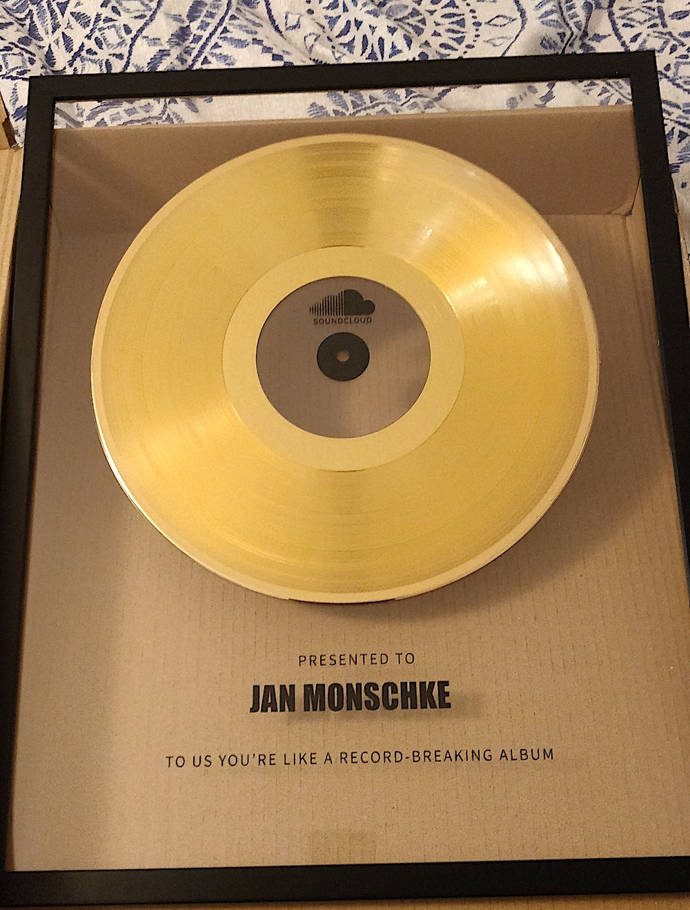

## Work / SoundCloud

It was my six year anniversary at SoundCloud this week 🥳 I still can't believe I've been at the company for that long. I'm incredibly grateful to work there and am still learning something new every day to this year. Here's to many more years ☕️ 🎉

The golden record was actually given to me at my five year anniversary, as it's the custom at the company. I could not think of a better image to celebrate this week's milestone. 😄

## Side projects

A reader on Twitter asked how much time I spend per week on side projects and how I have the energy to work on those. My previous notes on side projects must have given the impression that I work on them every day and all weekend. None of that is true. Most days I do not have the energy to work on anything after work and I'm happy to not be on a computer to be honest. Especially on weekends I am trying to decompress from digital tech as much as I can. 📚 🥾 🏕

All in all, I spend couple of hours, up to 6 or 8, per week on side projects. I reduced that time after reading [Josh's experience with Cubital Tunnel Syndrome](https://www.joshwcomeau.com/blog/year-in-review-2020/#q2-the-pandemic-and-an-injury).

### Blog

Most of that time this week I spent setting up [weeknotes](/weeknotes) and turning my weekly notes into [proper](/weeknotes/2021/02/) [prose](/weeknotes/2021/01/). I added all the notes to the index and then created a collection page and an RSS feed. I could re-use most of the [blog post](/blog) setup to be honest 🤩

### Ping

The biggest chunk of work on ping I actually did not spend with coding. I wrote up on architecture, data entities, business ideas and more in our [Notion](https://notion.so) 📝. We're certainly not planning to incorporate any time soon. However, it's very important to me to write these things down as early as possible to make sure we have a common understanding of where we want to go with this product. The architecture documents are a great reference for me and for potential future engineers 🕵️‍♂️.

I also learned a lot about [Cloud Firestore Security Rules](https://firebase.google.com/docs/firestore/security/rules-conditions) and [Collection group queries](https://firebase.google.com/docs/firestore/query-data/queries#collection-group-query) this week. As part of the proof-of-concept I want to check if Firebase supports all our queries and if its security model is both restrictive and flexible enough.

So far, the security model looks promising but it takes me some time to wrap my head around. The logic is executed in the storage layer and not on the application server which takes some getting used to. I'm going with a hybrid approach of very restrictive storage layer rules and more complex access logic in the application server. Right now feels good this way 😅. I wish there was an easier way to execute and write the access rules locally so that I would not have to do that in their UI. Maybe I should spend some time reading up on their [rule emulator](https://firebase.google.com/docs/firestore/security/test-rules-emulator).

I really like that Firebase supports subcollections at document level because it allows for great encapsulation and makes it easy to cascade-delete data. Until recently it was hard to query across subcollections though. E.g. if you had a relationship like `Post -> Comments` and you wanted to get all comments by a user. Without splitting up `Post` and `Comments` into top-level collections, it was not possible to execute that query ✂️. With the addition of [Collection group queries](https://firebase.googleblog.com/2019/06/understanding-collection-group-queries.html) you don't have to do that anymore. After adding an index for the subcollection, you can query it like any other top-level collection 🤯.

## Life

We are seeing a more snow these days in Berlin. It's still not enough for it to stick around for more than a couple of hours. But it brings us joy to walk through snow on our daily city hike. Due to the current pandemic situation here, we are sticking to walking late in the evenings. This lets us reduce the exposure to other people. However, the government is talking about introducing a curfew which could mean the end for that habit. Here's to hoping the curfew will not prevent this daily escape of the flat to clear our heads.

One of our recent favorite dishes is this [vegan tuna salad on bagel](https://www.instagram.com/p/CIfix5ZpqIm/) (recipe by Max La Manna). It's so easy to make, tastes super fresh and is pretty healthy on top of it. Writing about it now makes me want to have it again next week 😋.

## Entertainment

I finished reading "The Last Emperox", the final book in the [Interdependency trilogy by John Scalzi](https://www.goodreads.com/series/202297-the-interdependency). The final book, as it's often the case, was not the strongest one in the series. It felt like Scalzi rushed this one a bit to fit it into a single book. Some of the events could have been their own books but then they ended up being just a couple chapters long. But maybe that is just me being sad about the end of the series, longing for more of the same 😅

Staying on the topic of science fiction: This week I finally started watching season 5 of [The Expanse](<https://en.wikipedia.org/wiki/The_Expanse_(TV_series)>). The first episode is promising with new arcs popping up left and right and I felt right at home in the season. Looking forward to watching more of it.

## Song of the week

[Stefan](https://www.stefanjudis.com/blog/web-weekly-2/) released his notes faster than me and stole my music pick for this week, so I had to chose a new one. This week's song has a lot more melody and groove than the other recent ones and I hope you enjoy it as much. When this song comes up, I can't help myself but micro-dance to the tunes at my standing desk.

<iframe width="100%" height="300" title="Embedded song from SoundCloud" scrolling="no" frameborder="no" src="https://w.soundcloud.com/player/?url=https%3A//api.soundcloud.com/tracks/290368052&color=%23ff5500&auto_play=false&hide_related=false&show_comments=true&show_user=true&show_reposts=false&show_teaser=true&visual=true" loading="lazy"></iframe>
