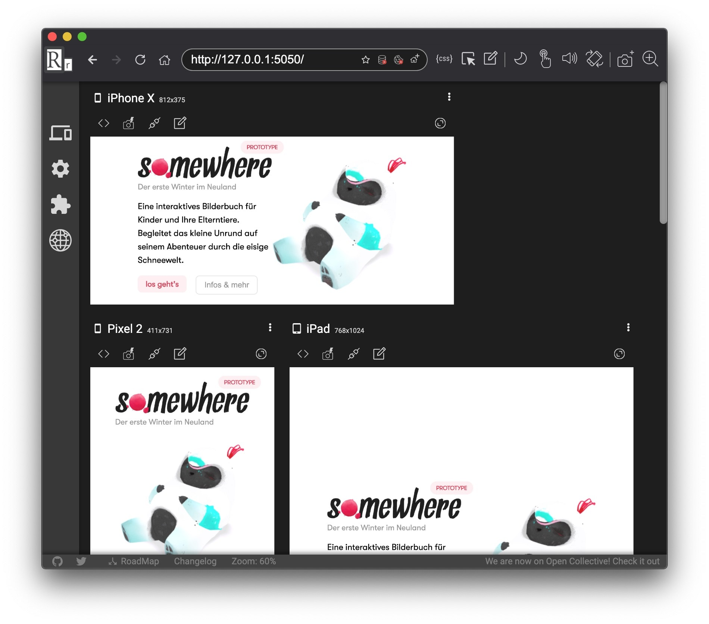
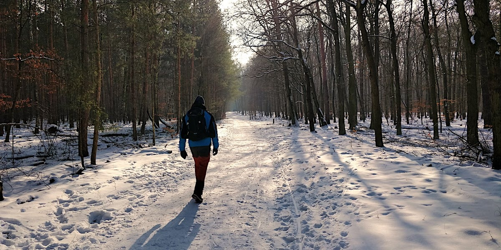

## Side Projects

### Somewhere

[Last week](/weeknotes/2021/06/) I worked on the foundation of the responsive behaviour for the landing page. This week I applied the constraints to the content on the page and worked out little issues here and there.

[Can](https://twitter.com/cangoektas) and [Julio](https://twitter.com/juliozynger) recommended a handy little tool called [Responsively](https://responsively.app/). It previews your site live on different device sizes and orientations. It has worked super well for me and I'm actually looking forward to using it again soon 😍

Next, I will replace the static image of that little creature on the landing page with a 3D animated version. The image will blend into the 3D canvas once the 3D model is loaded.

### Ping

I used my newly acrued knowledge of Firebase Cloud Storage to build the MVP of the file upload. As per my new usual, I first sketched out the behaviour of the module in XState's visualizer and once I was content, I added the actual implementation. I love this workflow because the XState UI allows me to play around with the machine without writing any of the business logic. This flow feels super natrual to me by now. 🌅

I'm happy with the upload and now [Julian](http://julianpanzer.com) and I are thinking of getting another developer on board. We want to ship an MVP as early as possible to a group of beta testers. I hope I can share more soon ☺️

## Hiking

We had lots of sun and snow this week which made for the perfect winter hiking weather 🥾. Though there are no impressive mountains in Berlin, there are quite some hilly forests. They're beatiful, even in the deepest winter. Life at work and with the move can be very hectic these days. I really need more of these [forest bathing](https://time.com/5259602/japanese-forest-bathing/) sessions!

## Entertainment

I finished reading [The end of all things](https://www.goodreads.com/book/show/23168809-the-end-of-all-things) by John Scalzi which was a great conclusion of the series. Now I'm lacking ideas for a new sci-fi series to start 😅

I might continue with [Space Team](https://www.goodreads.com/series/206992-space-team) where I'm midway-through and the author is 12 books in the series and promised to write more. So a steady source is guaranteed there. It's not so much hard sci-fi but more sci-fi in the same vein as Hitchhiker's guide to the galaxy. It's problematic to read at night because it does make me giggle out loud 😂

The other series I finished this week is [The Expanse](<https://en.wikipedia.org/wiki/The_Expanse_(TV_series)>). Not the books though, the series. I'm glad to hear there will be another season. I loved the little side-story on earth this season and was sad to see one of my fav characters die. 😭 It appears that the next season might be the last one before they take a break. I'm not complaining, I'm happy that Amazon bought the rights for the series after ScyFy decided to not continue it. They deserve a break. As long as they come back.

I did find a new series to watch already because the second season of [Snowpiercer](<https://en.wikipedia.org/wiki/Snowpiercer_(TV_series)>) (yes, there is a TV series that plays in the movie's realm) has been released. The first season was rather mediocre and the writing/acting didn't convince me. The second season started a lot stronger though and I'm looking forward to what's happening next. Especially how this all ties back into the movie's story.

## Song of the week

I took some long, sunny, snowy walks this week with my headphones on. Many funky, jazzy house tunes released on [Toy Tonics](https://soundcloud.com/toytonics) (a small Berlin-based label) provided the perfect atmosphere. Since I can only share one track each week (because, you know, those are the rules...I guess), I will give you this one by [COEO](https://soundcloud.com/coeo):

<iframe width="100%" height="300" title="Embedded song from SoundCloud" scrolling="no" frameborder="no" src="https://w.soundcloud.com/player/?url=https%3A//api.soundcloud.com/tracks/178406952&color=%23ff5500&auto_play=false&hide_related=false&show_comments=true&show_user=true&show_reposts=false&show_teaser=true&visual=true" loading="lazy"></iframe>
