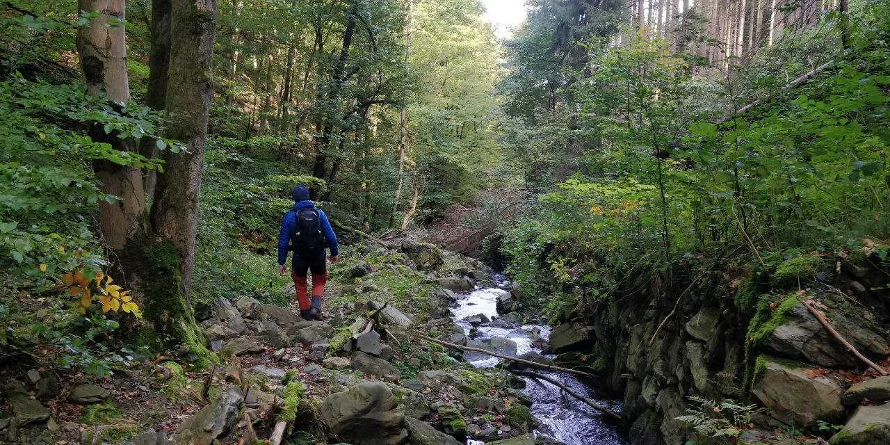
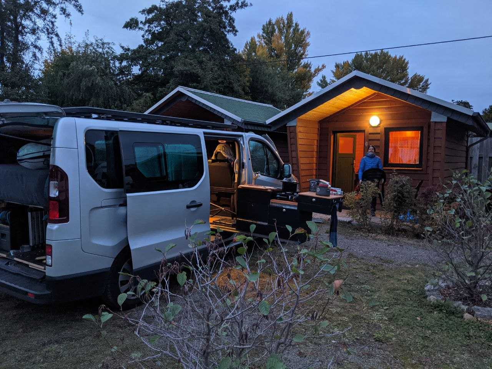
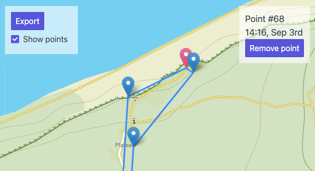

## Life

I took all my remaining vacation days and went hiking with a friend. We went to the Harz mountains in central Germany. They’re not as high as the Alps but they offer plenty of interesting trails. A good mixture of strenuous slopes, dense forests, sandstone caves and great views. Especially in autumn when the trees are so colorful.

It’s rather cold these days and nights so I opted for a small cabin instead of my tent this time. It was also the first time my friend used his converted camper in temperatures close to zero. We both made it through the nights comfortably.

We recorded all three hikes on Komoot in case you’re curious to explore the Harz mountains yourself. ([Hike 1](https://www.komoot.com/tour/527402427), [Hike 2](https://www.komoot.com/tour/529188835), [Hike 3](https://www.komoot.com/tour/530287315))

## Side projects

### GPX viewer and editor

Hiking reminded me of a small application that I built a couple years ago. It’s a GPX viewer and editor. It visualizes recorded GPS tracks from GPX files and gives you a simple interface for manipulating recorded GPS points. My use-case was to clean up GPS recordings before uploading them to trail websites (like [Komoot](https://komoot.com)). Sometimes individual GPS points are way off and my phone often records wrong elevation values. The tool allows you to clean up those points and to remove the elevation data altogether.

It’s pretty clunky to use and the track files are hard-coded. I have to go into the source code every time to change the file paths. I dread to use it every time.

But because it is so useful, I thought I would take the time now to finally finish it. Make the UI look a little nicer, allow to drag’n drop GPS files. In just a couple of hours I managed to get it in quite a good shape and I will finish it this week, I hope.

In order to make it more of a challenge for myself, I built the editor on top of [lit-html](https://lit-html.polymer-project.org/guide) and [xstate](https://xstate.js.org/docs/). Getting a bit out of my create-react-app comfort-zone here and I’m quite enjoying it. I’ll make sure to publish the project and the code.

## Work

‘Tis the season of the team events it seems. My product team got together for only the second time ever since we’re working in this setup. Our PM managed to convince a super-hip Korean restaurant to open for lunch for us (they usually only do dinner service). Their set menu with tea pairings was exceptional 🥰 Will definitely go again for dinner! (@ [Choi Berlin](https://choiberlin.de/)).

Right after that we headed to the office for the grand re-opening celebration. It was great to see many of my colleagues one last time in person before I leave. And as on any SoundCloud party, the DJs were spectacular. I hope I’ll be invited to future events 🥳

The web collective also got together for an event last week. A remote Pizza-making workshop 🍕😍. While I had my doubts about a pizza made from scratch in an hour, I was pleasantly surprised with the outcome. That recipe is a keeper. Everyone managed to bake a decent pie, even my colleague who did not have an oven at home and had to resort to using a pan 🥘 😅

## Entertainment

📚 I finished [Utopia Avenue](https://www.goodreads.com/book/show/52597312-utopia-avenue). David Mitchell is one of my most favorite authors but his last two books were not too much of my liking. Utopia Avenue turned that trend around. The story follows a psychedelic rock band in the 1970s, it’s creation, their rise, their conflicts, politics feminism and mental health. Told from the perspective of the individual band members in a true Mitchell fashion. Of course the story is inter-woven with other arcs from previous Mitchell books.

🍿 Like pretty much everybody else I know I binged Squid Game. My expectations were not that high so it definitely lived up to them. Very weird (in a good way), at times heart-breaking, generally very enjoyable. Don’t expect a lot of depth and you’ll be very entertained. Unless you cannot stand gory scenes 😉

## Song of the week

One of those tracks that immediately triggers a flow state when I play it. Perfect for writing and programming. _Life in the Rain_ by Quantic:

<iframe width="100%" height="300" title="Embedded song from SoundCloud" scrolling="no" frameborder="no" src="https://w.soundcloud.com/player/?url=https%3A//api.soundcloud.com/tracks/279901774&color=%23ff5500&auto_play=false&hide_related=false&show_comments=true&show_user=true&show_reposts=false&show_teaser=true&visual=true" loading="lazy"></iframe>
