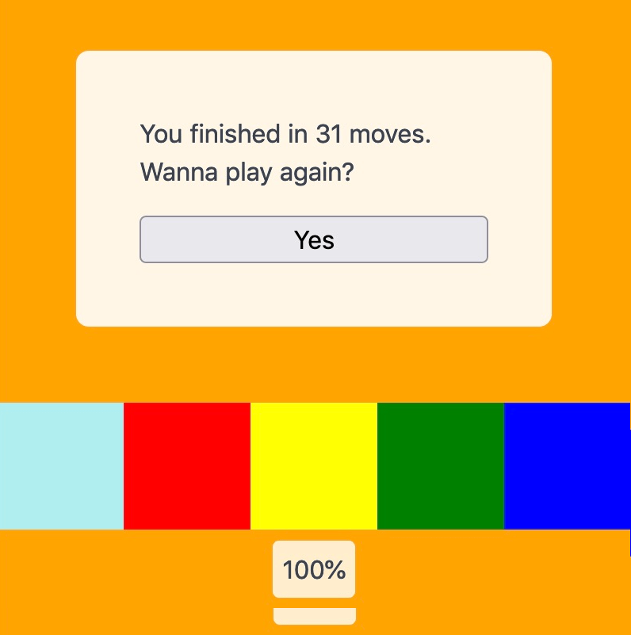

## Work

Last week [Elastic 8.0 was released](https://www.elastic.co/blog/whats-new-elastic-8-0-0) 🎉. My contributions to this big release were rather minor since I joined when teams were wrapping up their 8.0 work already. It was very interesting to see the collective work towards such a big release. Hope the community will be as happy with that version as we are. I cannot wait to get my first bigger features into the next release 🙌.

## Side projects

I made some progress on the color-picking game that I was writing about [last week](/weeknotes/2022/02). The game now has three different multiplayer modes: a) play against the computer b) challenge a random player c) play against a friend. The "AI" in a) is actually quite challenging, yet was quite simple to implement. It basically looks at the field and calculates the _potentially best next_ move. It's not smart enough to look ahead or take the other player's move into account. However, it is fun to play against it 🤖.

I also just now finished building the first iteration of the single player mode. It was surprisingly easy since I built the game logic in a modular way and basically just needed to create a new state machine for this new mode 🎉.

The next task is to make the field generation more predictable and work with a seed phrase rather than tons of `Math.random()` calls. The goal is to eventually be able to share fields and/or to generate a daily challenge where the seed depends on the current date (hat tip to Wordle 👋).

<small>If you're interested in beta testing the game, send me a message on Twitter</small>

## Entertainment

🎲 Played [Cartographers](https://boardgamegeek.com/boardgame/263918/cartographers) for the first time. I bought this one on a whim at my local board game shop when I was looking for a new collaborative game. Cartographers is not collaborative but also not really competitive. Each player has to draw a map based on criteria that is gandomly generated for each round. The map is then graded and the player with the most points wins.

Players mostly work on their maps independently but some cards require you to draw on your opponent's map. It was easy to understand the rules and all players immediately wanted to play another round 🥳.

🍿 I started watching season 4 of [Ozark](<https://en.wikipedia.org/wiki/Ozark_(TV_series)>). It continues as strong as before, that is, if you liked the show before, you will like season 4 as well. It's interesting that they split up the season in half with the second half coming out in May. Makes me not want to watch it so quickly because of the inevitable cliff hanger after the first half.

I've been watching a series with friends every Wednesday but now that we finished [The Expanse](/weeknotes/2022/02) we ran out of ideas of which shows to watch. If you have any recommendations, let me know 😄

## Song of the week

What's that, the same artist two weeks in a row? Yep, it's Delv!s again! This time with his single _Brother_:

<iframe width="100%" height="300" title="Embedded song from SoundCloud" scrolling="no" frameborder="no" loading="lazy" src="https://w.soundcloud.com/player/?url=https%3A//api.soundcloud.com/tracks/560562795&color=%23ff5500&auto_play=false&hide_related=false&show_comments=true&show_user=true&show_reposts=false&show_teaser=true&visual=true"></iframe>
