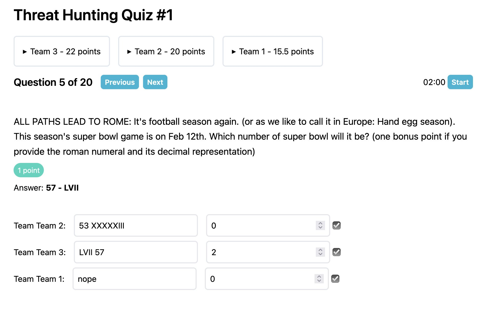
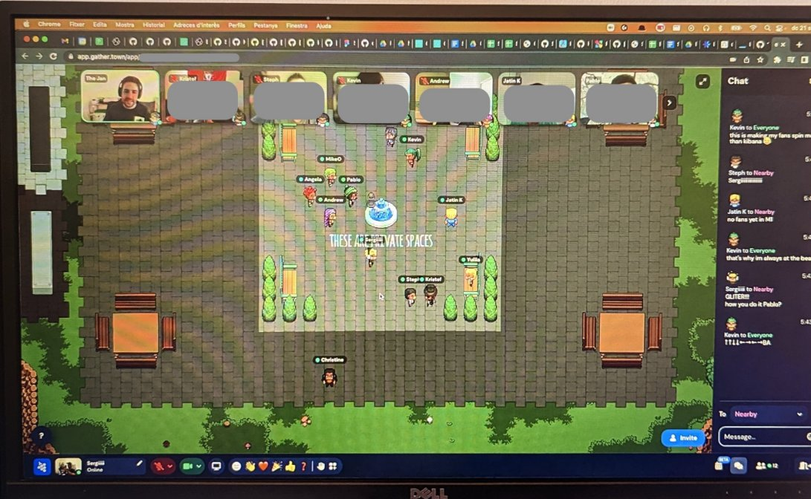

## Life

Fall has started and temperatures are dropping quickly in Berlin. Yet, somehow we managed to see plenty of friends in parks the last couple of weekends. It's neither too cold, nor too windy, just the right temperature (with the right clothing 😅).

Most days we're now preparing the flat for the baby. Every day feels like Christmas as boxes and boxes of (mostly second-hand) baby items arrive. There are so many good offers on eBay Kleinanzeigen and Vinted and all of them were in great condition so far. The only problem we had was a baby monitor that turned out to be a recalled product. The battery could potentially overheat and burn your skin 😰. Luckily we got a refund from manufacturer and were able to replace the item!

We feel a lot more prepared after a birth preparation course and plenty of great advice from friends and our midwife. In general, the support we received in Berlin has been outstanding. When it comes to organizing child care however, it feels like the wild west. There are processes put in place by the city of Berlin and then there are child care providers that tell you they will not follow those processes. They pretty much make up their own rules 🙃

After just over eight years it was time to replace my old MacBook Pro and it's the first time I did not go for a `Pro` MacBook. I went with a M2 MacBook Air and it's been a great decision. It's so fast, so light, has a nice screen and the battery seemingly lasts forever 🥰. Especially with [MacOS Montereys's Low Power Mode](https://www.apple.com/macos/monterey/) ✌️ I have low power mode enabled all the time and the laptop still feels snappy for all for my everyday tasks such as working on my side projects, browsing, streaming. Such a marvelous device 🎉

## Work

Got to go to my first (in-person) conference since the end of 2019 and it went great! I chose React Finland since I'm working with React at work pretty much every day. And because my friend [Nik Graf](https://mastodon.social/@nikgraf) was scheduled to give a hilarious meta talk about the [weird things about React](https://www.youtube.com/watch?v=25QQcPSzH8Y&list=PL-a9lBflNu2ph1J-a19LNLo3GKikBDsWZ&index=10). I had never been in Finland before and loved Helsinki. When taking a break from the conf, I spent time in one of the many cute cafés, took a walk to book shops and sat in one of the many nice parks. Will definitely come back again. Special shoutout to the [Stately](https://stately.ai/) crew, who were super fun to hang out with.

The last two weeks before the start of my parental leave have started. My final task is a major refactoring of a plugin that is a core part of the application my team works on. It involves talking a to the original implementors, hearing a lot of apologies about decisions that were made. It's weird how people apologise now for decisions that were perfectly fine 3 years ago, under different circumstances. In any case, progress is going great and I'm confident I'll be able to ship it before the birth of my son.

## Side projects

I'm preparing a remote pub quiz at work and found that while it's possible to keep score on paper, chances to get something wrong are quite high (for me at least). So obviously I decided to build an web app to help with with keeping score. In the app you create quizzes upfront. It supports regular multiple choice, open ended and estimation questions. When it's time for running the quiz, a new session can be started, teams randomly assigned and scores taken on the go. There's also the option to set time limits for questions.

This project gave me the opportunity to try out [Remix](https://remix.run/) and I think I liked the experience so far. I'm not sure I'm doing things the proper Remix-way but the docs are not always clear on how things are supposed to be done. In any case, I love the approach to stick as close to web standards as possible! Oh, and [Prisma](https://www.prisma.io/) is great too!

The code is [available on Github](https://github.com/janmonschke/quizzo), in case you're curious. It also contains some questions to get you started in hosting your first quiz.

(note from the future: The quiz went well. People loved the [Gather Town](https://www.gather.town/) setup specifically.)

## Entertainment

- 📚 I started reading [The Code Breaker by Walter Isaacson](https://openlibrary.org/books/OL32009035M/The_Code_Breaker) (which I got in Helsinki). Usually I don't read biographies, but this one is fascinating me as it's about Jennifer Doudna, one of the creators of CRISPR gene editing. Genetics was one of my favorite topics in high school and I wanted to learn more about CRISPR for a long time. I am specifically loving the chapters on the ethics of gene editing.

## Song of the moment

A very mellow track by Kraak & Smaak called Twilight. The intro doesn't do justice to the rest of the song. The build-up of the soundscape is outstanding ❤️:

<iframe width="100%" height="300" scrolling="no" frameborder="no" loading="lazy" title="Embedded song from SoundCloud" src="https://w.soundcloud.com/player/?url=https%3A//api.soundcloud.com/tracks/726190648&color=%23ff5500&auto_play=false&hide_related=false&show_comments=true&show_user=true&show_reposts=false&show_teaser=true&visual=true"></iframe>
