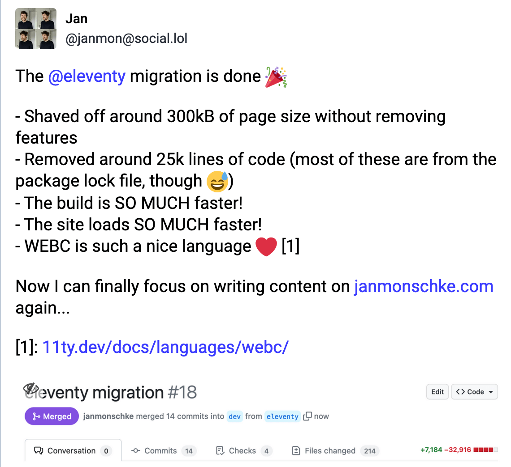

## Life

My son finished the fourth week of settling into daycare. In Berlin, as probably in a lot of other places, kids are slowly settled into their daycare routine. In the beginning I stayed with him there, observed him play with the other kids. Then I gradually left for longer durations. Until he's ready to have his lunch nap there and feels confident to interact with other kids and play by himself.

He was curious from day one and, as most kids were older, he was not afraid. Judging from the experience of friends, we were quite lucky that in week two he was already sleeping there and that he generally didn't reject being there. They only had to call me once and that was just before his nap time anyways. We're super proud of him and he's developing so much there ❤️

Speaking of which, he grew so quickly and the time flew so fast. My wife and I spent nine months after birth taking care of him together. The parental leave in Germany is quite generous and my employer gave me four extra months on top. Including the daycare month, I've now spent 10 months taking care of him (of which we both worked 3 months part-time). But it feels like much shorter than that. It feels like yesterday that he was such a tiny nugget. And now he's crawling like a champ, wants to go faster on the bike and starts to blabber. 😍

For several weeks we have now been looking into buying a cargo bike to help us bring the little one to daycare, to do big groceries and to go on bike trips with friends. There are so many different models on the market now which makes it hard to find the right one. Or rather, they're all great, just the it's hard to choose when there are so many options. Where we live in Berlin, we see a lot of [Muli bikes](https://muli-cycles.de/en/bikes/motor) or [Urban Arrows](https://urbanarrow.com/).

The Muli is great because it's compact and very agile. It doesn't feel like cargo bike when you drive it, even without a motor. The Urban Arrow is a lot more inert, less agile and just very big and bulky. There are advantages to long bikes like the Urban Arrow e.g. the large amount of space, but they are ultimately too big for us.

We almost decided to get the Muli, but then friends recommended the [Chike](https://chike.de/e-kids/) and that's the bike we're currently aiming to get. Before that, we want to rent it out for a longer tour though since so far we only had it for 30 minutes when testing it out at the dealership. Our son loved it, of course. It's a cargo bike made for transporting kids. The special thing about the Chike is that it has three wheels, two in the front, one in the back. Which in itself isn't that special and there are plenty of other bikes with the same configuration. However, the Chike's front wheels tilt when taking turns and so it feels much more like a two-wheel bike. I recommend checking out their promo video, it's a very unique bike.

## Work

This week was my first week back at work. I was mainly catching up with what happened in the past months and then I of course had to redo plenty of the corporate trainings, haha. Many of my coworkers are still on vacation, which made it a very easy start so far. Easy is good, since it will take me some time to adjust to this new schedule. Morning routine with the little one, his morning nap, dropping him off at daycare, work work work, picking up the kiddo, evening routine, a little bit more work (meetings with the US) and then bed. Ouff. Let's see how that'll go.

## Side projects

I ported this blog to [Eleventy](https://www.11ty.dev/docs/) last week. There was no real need to do this other than me being upset about how slow Gatsby was and how pointless it felt to load React on this blog. This is not a rant agains React, or any framework for that matter. It's just that it's completely unnecessary on a site like this one.

Porting the blog went super smoothly, given I had already done the same a few months back with my [hiking blog](https://aweekinthewoods.com/). Interestingly, the hiking blog started off as a clone of this blog. Was then ported to Eleventy. To then ultimately be the template for this blog's port to Eleventy. We went full circle there. 😄

This site is now 300kB lighter, loads and builds much faster and uses only native web features under the hood (including web components, thanks to [WebC](https://www.11ty.dev/docs/languages/webc/)). The hardest part was to change all the `className` attributes to `class` 😅. I must say that I feel a lot more comfortable with Eleventy's collection and JSON data sourcing than with Gatsby's GraphQL. Which, of course, is a personal preference. I also [tooted about it](https://social.lol/@janmon/110968694684373814).

I had to alter the webmention implementation that I talked about [in this blog post](https://janmonschke.com/adding-webmentions-to-your-static-blog/) a little bit which makes me think I should write a follow-up post that explains the (minimal) changes that are necessary.

## Entertainment

- 📚 [Project Hail Mary](https://openlibrary.org/books/OL30036715M/Project_Hail_Mary) was a fun read, very much like The Martian was. I read it really quickly, loved the character development. Even though the similarities to The Martian are obvious, it does not feel repetitive. I'm looking forward to the movie adaption and how Ryan Gosling will do in the main role.
- 📚 Now I'm reading [Leviathan Wakes](https://en.wikipedia.org/wiki/Leviathan_Wakes) which is the first book in the Expanse series. I'm a fan of the TV show that's based on these books and was sad to learn that they cancelled the show. Since the TV show only covers around 6 and a half books out of 9 of the novel series, there's a lot more to read. No, let me rephrase that. A TON. Those books are huge.
- 🍿 My wife and I re-watched [Motherland](<https://en.wikipedia.org/wiki/Motherland_(TV_series)>). It was one of the shows that we watched before the birth of our son as part of our "preparation" 😅 We were able to relate to some of the parent's stories already. The shows cracks us up every time and we'll be watching it again and again.
