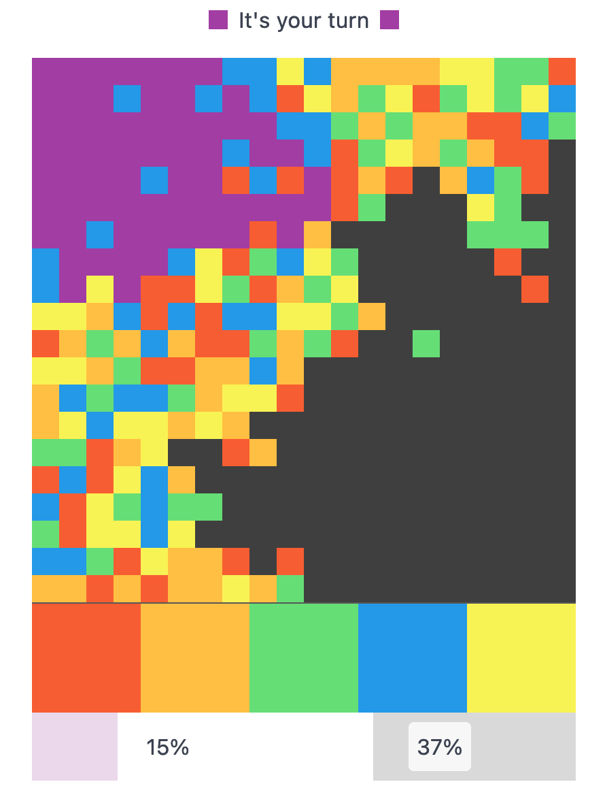

## Life

For the first (and probably last time) this summer, I was able to make it to [Jan's open lunch at Zenner](https://narrativ.es/@janl/111028575484732060) (a beer garden next to the river, inside a beautiful park). It was fun to meet some folks that I hadn't seen in literally years. Even though pretty much everyone there worked in tech, the conversations didn't necessarily revolve around that. One thing that came up were the not so uncommon boar or fox sightings in Berlin. You know, [those Berlin boars that steal laptops at nudist lakes](https://www.bbc.com/news/world-europe-53692475) or that [are sometimes mistaken for lions](https://www.theguardian.com/world/2023/jul/21/escaped-lioness-berlin-most-likely-wild-boar). 🐗🦁

I went to the park with the cargo bike that [we rented from Robin](/weeknotes/2023/02) the week before. It was the longest ride on that bike so far (around half an hour). The day before, we had already decided to get the same bike, so I was already imagining myself, riding those distances with my son very soon. We signed the leasing contract at the end of the week and are now waiting for the delivery. It should arrive in 2-3 weeks 🤞 (It's a [Chike e-kids](https://chike.de/e-kids/))

Our son had pretty high fever for 3 days this week, so we took time off to take care of him. He didn't have any symptoms apart from the fever which we found odd. Later on we learned that there is a children's disease that's literally called three-day-fever (at least in German, in English it's Roseola or sixth disease). The fever went away as quickly as it came and we were able to spend some time outside over the weekend. ☀️

One of the things we did right after he felt better, was to treat ourselves to some yummy Brammibal's donuts. To our delight, they had already started pumpkin pie spice season 🎉. Pumpkin pie spiced latte makes for the perfect donut pairing. But also reminds us that the days will be colder from now on 😅

## Side projects

I managed to get _most_ of the remaining work done on the project that I mentioned last week (everything apart from a blog post about it, but more on that later). It's a color-matching game that I now have build a couple of times. Each time with a completely different tech stack. Each time I built it for a different reason. And every time it made sense to rewrite it. While I was pondering those previous iterations of the game, I got very nostalgic and I feel like it's worth a proper blog post. Which is the perfect side project for the next week(s).

Anyhow, the game can be played here: [colorbattle.app](https://colorbattle.app/) 🕹️

While it's technically a multiplayer game, you don't need to wait for other players to get started. There are two modes where you can challenge the AI (ouuuuuhhh) and also a single player mode.

Let me know what you think about the game 🤩

## Entertainment

- 📚 I'm almost done with [Leviathan Wakes](https://en.wikipedia.org/wiki/Leviathan_Wakes) and I don't remember much of the ending from the TV show. Either they completely rewrote the ending for the show or I really just forgot. I'll rewatch the last episode of the first season after I'm done with the book
- 🍿 I finished Painkiller. The ending was intense, shook me in so many ways. Can highly recommend the show but be warned that it might ruin your good mood 😉
- 🍿 The [trailer for the final season of Sex Education](https://www.youtube.com/watch?v=WldgrH9SvbE) dropped and it looks great. Can't wait for the season to start. Though, I'm already sad it'll be the last one.

## Song of the week

Ginger Root - Loretta. This tune has been stuck in my head since this summer. It just won't leave. And that's okay. Ginger Root will be playing in Berlin this October but I don't think I'll be able to make it 😭.

