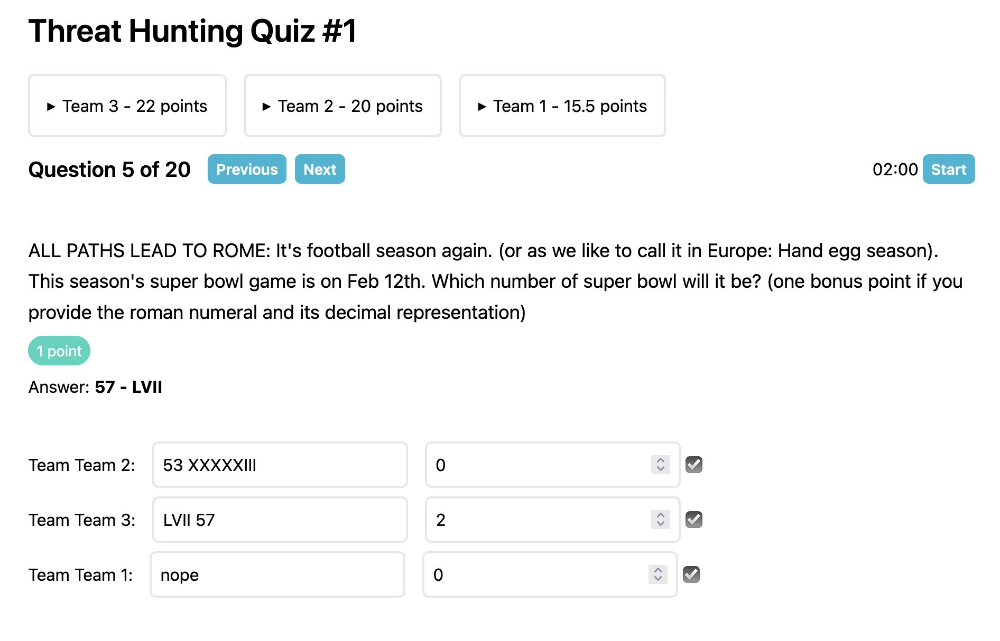
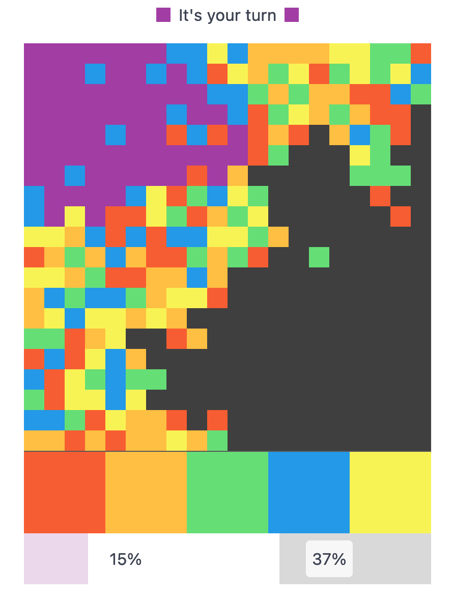

Bye, bye 2023 👋 

- [2023 resolutions](#2023-resolutions)
- [Highlights](#highlights)
- [Side Projects](#side-projects)
- [My top 3 blog posts](#top-3-blog-posts)
- [Favorite books](#favorite-books)
- [Favorite TV shows](#favorite-tv-shows)
- [Favorite podcasts](#favorite-podcasts)

## Resolutions for 2023

### Finish writing all hiking reports on my [hiking blog](https://aweekinthewoods.com)

I did not finish writing the "two" remaining reports. One is for a trip to the Lake Disctrict which should fit into a single post. The other one is about hiking the Kungsleden, which is more like a four part series. The hardest part is editing all the images. The text comes naturally after looking at the images. Hope to finish at least the Lake District one this year.

Even though I did not write any content for the hiking blog, I did manage to spend time on improving the site (🚲🛖):
  - I [migrated the site to Eleventy](https://github.com/janmonschke/aweekinthewoods/pull/15) which reduced the site's size by A LOT. It is so much snappier now. It builds faster. Has a better dev experience. Saves a ton of bandwidth. God, I love [Eleventy] <3
  - Created [a custom map (web)component](https://aweekinthewoods.com/scotland/west-highland-way/). This one is much smaller in size as the Google map, it's customized to my use case and I am able to provide the KML files as download now ([source](https://github.com/janmonschke/aweekinthewoods/blob/b5bfecb1998f3f76312fd98faf1689d6bcdd70e9/_components/hike-map.webc)).

### Write more weeknotes than in the previous year
I failed this goal. I published 5 weeknotes this year, the same amount as in the year before.

I remember being very motivated to achieve this goal when I set it. But being back at work full-time, entertaining my son every free minute and just being exhausted from all that meant that I did not find the time during the week to write up my notes.

I'm not sure I'll be able to write more notes this year but I'll try 🤞.

### Reading 12 books this year

My regular reading goal was 25 before my son was born. I knew that I wouldn't have that much time this year so I reduced it to 12. I am happy to report that [I managed to read 15 books in total](http://bookrastinating.com/user/jan/2023-in-the-books?key=0802fc987d184bce95ed21caddad45b1).

My goal for this year will be to slowly ramp up that number. I'm not setting a specific goal but it would be great to read more than 15 books this year.

## Highlights

### Being on parental leave
A combination of a very generous parental leave policy at my current job and the general parental leave allowance in Germany allowed me to basically be on parental leave from November '22 until September '23. My wife and I worked a couple months part-time, so it wasn't all fulltime parental leave but it was a great decision to take so much time off together.

I witnessed all of my son's major developments. From barrel-roling, to crawling to walking. Being together the three of us for so many months, we were able to spread the (mental) load as equal as possible. While it was never 50/50, we found a system that worked well for us.

We also managed to travel to see our families. The little one loves riding long-distance trains. When he was a baby, he basically slept through it. Now that he can walk, he explores the train, makes friends with other kids and sometimes even manages to take a nap ;)

Travelling with a kid is not the same as what it used to be, yet, we enjoyed it. It made us re-explore the places we were familiar with. First we were always looking for baby-friendly cafés to chill in and now we're exploring all the playgrounds we can find.

### Getting a cargo bike was a great decision
This was probably the topic that I researched most this year. There are so many options out there. We were able to try out some bikes from friends and bike shops. There's only so much you can research upfront. Without trying out the bike, it's hard to know if it works for you and your family.

We decided on a [tilting three wheel bike with a fixed cabin in the front](https://chike.de/e-kids/). The cabin is super comfy. It being closed, makes riding in winter very smooth. The tilting mechanism allows us to ride in a sportive way. It's our favorite bike now and we use it even without our son.

### My French improved a lot this year.
We're raising our son bilingually. I speak German with him and my wife French. At the beginning of the year we would also add English to the mix, because that's the language that my wife and I were used to speak together. At some point we decided to try to speak only French/German when our son is around and to our surprise, this worked quite well. By doing this, I also noticed that I feel a lot more comfortable speaking French. (Note: I did speak a little French before, so I didn't start at zero)

We went to France three times this year and every time I was more and more able to communicate without the help of my wife. I'm far from being fluent, but I feel like I'm on a good track to make significant improvements in my spoken French over the next couple of years.

### Coffee setup <small>(aka becoming a coffee snob)</small>
I'm happy to report that this year I've become a proper coffee snob ☕️🤓. My search for a good-enough but not over-the-top espresso setup was successful. Again, there were so many options and I spent so much time researching. Since our kitchen didn't have a lot of available space, it was clear from the start that I didn't even need to look at fancy machines.

During my research, I found the niche of manual espresso makers. These typically only require you to add ground beans and hot water. Pressure is generated by pushing lever(s). The model I went for is the [Rok Espresso GC](https://www.rok.coffee/espressogc) which hit that sweet spot in terms of budget and size. In true coffee snob passion, I spent more money on a manual grinder. I went with the [1zpresso J-Max S](https://1zpresso.coffee/j/), since that one works especially well for espresso. It took me a couple of tries to dial in the system but now I'm super happy with it.

I even did go a step further and got myself a [Wacaco Picopresso](https://www.wacaco.com/products/picopresso) to take with me when we're travelling. It's super handy and looks so tiny in my suitcase next to the gigantic grinder, haha. The Picopresso workflow is similar to the Rok workflow, so I didn't need to make a lot of changes. Instead of pushing levers, the Picopresso works has a hand pump to genereate pressure. I'm not 100% there yet in terms of results but the results are already impressive, coming from such a small machine.

<small>(Added bonus: The Picopresso saves us a ton of money and frustration in cities where they charge upwards of 6€ for a mediocre cappucino. I'm looking at you, Paris 👀)</small>

## Side Projects

I didn't expect to actually have time to work on side projects this year. But every now and then I managed to squeeze in an hour or two in the evening or during nap time when I felt motivated. Neither projects that I worked on were new projects. They were all projects I wanted to finish/work on for a long time.

### [Quizzo](https://quizzo.janmonschke.com)

I started working on Quizzo in late 2022 while I was at React Finland. At that time, I was working on a virtual pub quiz that I wanted to play with my team at work. From previous quizzes, I knew that keeping track of the score was hard and cumbersome.

Naturally, I started to work on a web app that would let me create a quiz, help me to allocate teams and keep track of points during the quiz. It worked well for the first quiz. I did keep a paper backup of the quiz around though, in case the app would fail.

This year, I ran another pub quizz at work. In preparation, I found notes from the first quizz. Specifically, notes about what worked and didn't work when I ran the quizz. The main pain point was that I had to manually enter each team's answer. In our virtual quiz session, I would ask the team captains to DM me their answers which I then had to manually enter into the app. This became a problem especially for speed rounds where the first team to answer gets the points.

My solution for this was to add a "team" page, where the each team's captain sees the current question and can enter their answer. Whenever the question changes, the page automatically refreshes and shows the next question. Answers are added to the quizz host's overview (see screenshot) in real-time. To my surprise, adding this functionality was pretty simple and the real-time component based on [Server-sent events](https://en.wikipedia.org/wiki/Server-sent_events) prove to be reliable.

Team captains are not required to sign in. The quizz's host sends each team captain a special url containing a secret token. The secret token authenticates the team captain to submit questions for only their team. The only person that needs to sign up is the quizz host. This was only necessary to have some basic protection against teams trying to send answers through the quizz host routes.

After a bit of polishing, I published the project under [quizzo.janmonschke.com](https://quizzo.janmonschke.com). There's few documentation at the moment since I don't really expect people to use it. It's built for my use case of hosting remote quizzes and maybe showing friends/colleagues how to use it. The sign up is open, so everyone could technically use it. It shouldn't be too hard to figure out the flow. Maybe I find the time this year to add some rudimentary documentation.

### [Colorbattle](https://colorbattle.janmonschke.com)

Most of the game was finished already in 2022 but it was a little rough around the edges. I spent some time cleaning up the UI, added better onboarding and a new daily challenge that gives players a unique challenge each day.

Like Quizzo, this game also relies on real-time communication. Given the nature of this being a game, it needed a "presence" checker. Using SSE wasn't an option in this case, so I used websockets. They're a little more fiddly than SSE, so it took some time to get the server-client communication right. I've played many rounds with friends since then and haven't encounctered any issues so far.

I also moved the app off of Heroku and it's now hosted on [Railway](https://railway.app?referralCode=aaNq2D) (which I love btw!)

The game can be played here: [colorbattle.janmonschke.com](https://colorbattle.janmonschke.com/) 🕹️

### [A week in the woods](https://aweekinthewoods.com)
This is my hiking blog that I mentioned above. This year, I managed to migrate the blog from Gatsby to [Eleventy], create a custom hiking map and move it off of Google fonts.

Maybe I'll managae to work on the content this year...maybe...

## My top three blog posts

Looking at my [Cabin stats](https://withcabin.com/), these are my site's top posts this year:

- [Changing my online identity](/changing-my-online-identity/)
  - My first post this year in which I explain why I deleted my Twitter account and changed my main online persona after switching to Mastodon. Looking at the current state of Twitter, I still stand by what I wrote and am happy to have found a new community ❤️
- [Adding webmentions to your static blog](/adding-webmentions-to-your-static-blog/)
  - This one was published just a couple of weeks after the online persona post. I still use an architecture that is very similar to the one I explain in this post. However, I migrated this blog to Eleventy, so the Gatsby part of that post doesn't apply anymore. I should really find the time to write an updated post that explains how to use the system in Eleventy.
- [Building a minimal i18n library](/building-a-minimal-i18n-library/)
  - This post is from 2019 and every once in a while it gets picked up in blogs or newsletters. The i18n library I am describing in this post is meant for tiny projects. It's super simple to use and doesn't require build steps which some people seem to like over the more complex alternatives out there. I'm still proud of it and I am using it in many of my side projects. However, I would still not recommend it for production usage in _actual_ products.

## Favorite books

As mentioned before, I managed to read 15 books this year. Three more than I set my goal to. I'm hoping to read the same amount or more this year. My favorite books this year were:

- [Project Hail Mary](https://bookrastinating.com/book/14342/s/project-hail-mary)
  - I loved `The Martian` and `Artemis` was okay. `Project Hail Mary` I might like even more than The Martian. It's a very unusual "first contact scenario" with a very witty main character. Style-wise it's very similar to The Martian. Which is probably why I liked it so much. I read that they're producing the movie this year and Ryan Gosling will be the main character. It'll be fun to see him in this very nerdy role.
- [Kaiju Preservation Society](https://bookrastinating.com/book/28931/s/the-kaiju-preservation-society)
  - This one hit me by surprise. It was so funny and weird. It had parallel universes in it but didn't feel too SciFi-y. Probably also the first book that I read that talks about the Covid pandemic.
- [Leviathan Wakes](https://bookrastinating.com/book/220/s/leviathan-wakes)
  - A couple years after `The Expanse` finished/was cancelled, I decided it's time to find out how the story continues. The books are great, possibly better than the show (and its sometimes sub-par acting). It's fun to compare the show's arc to the book's arc and to be surprised by how much deeper the books are going.
- [Artifact Space](https://bookrastinating.com/book/41371/s/artifact-space)
  - `Artifact Space` is the promising beginning of a space opera series. The characters are very well written, the tech is believable. It took me some time to get into but once it got me, I didn't want to put it down.

A complete list of all the books I've read in 2023 can be found on [BookWyrm](https://bookrastinating.com/user/jan/2023-in-the-books?key=0802fc987d184bce95ed21caddad45b1).

##  Favorite TV shows

- [Ted Lasso](https://en.wikipedia.org/wiki/Ted_Lasso)
  - Even though season three (the final season) wasn't as strong as the previous two, I really enjoyed this one. The show makers found a good way to finish it. The episode in Amsterdam, as cheesy as some people find it, was my favorite.
- [Sex Education](https://en.wikipedia.org/wiki/Sex_Education_(TV_series))
  - Another final season this year. This one had a weak start but then it got stronger. The end was sound. I related strongly with one of the main character's struggles this season since a very similar thing happened to me this year...
- We didn't really watch a lot of new shows this year. In the early winter months we started (and finished) a [Friends](https://en.wikipedia.org/wiki/Friends) marathon. The summer months we rewatched [Brooklyn 99](https://en.wikipedia.org/wiki/Brooklyn_Nine-Nine).
- Somehow we didn't watch the final season (*another* final season...) of [The Marvelous Mrs. Maisel](https://en.wikipedia.org/wiki/The_Marvelous_Mrs._Maisel). It's very high up on our list for this year though.

## Favorite podcasts
  - [Tech Won't Save Us](https://www.techwontsave.us)
    - I really only got into this podcast this year and I caught up quickly with older episodes. The research that's put into each episode and the depth of topics is outstanding. This [four part series on the evil that is Elon Musk](https://www.techwontsave.us/episode/189_elon_musk_unmasked_origins_of_an_oligarch_part_1) is a great starting point to get into this podcast.
  - [20k hertz](https://www.20k.org)
    - A rather recent find but I'm already caught up with all episodes of 2023. This podcast goes into detail on sounds/jingles/audio tech such as this episode on the [Wilhem scream](https://www.20k.org/episodes/wilhelmscreamremix) or this [Zelda mini series](https://www.20k.org/episodes/zeldabeep) that brought me straight back to my childhood.
  - [Darknet Diaries](https://darknetdiaries.com)
    - Darknet Diaries is still my favorite podcast and it delivered again this year. It started off with a longer break but then came back with great episodes. My favorite one was [I'm the real Connor](https://darknetdiaries.com/episode/133/).

[eleventy]: https://www.11ty.dev/