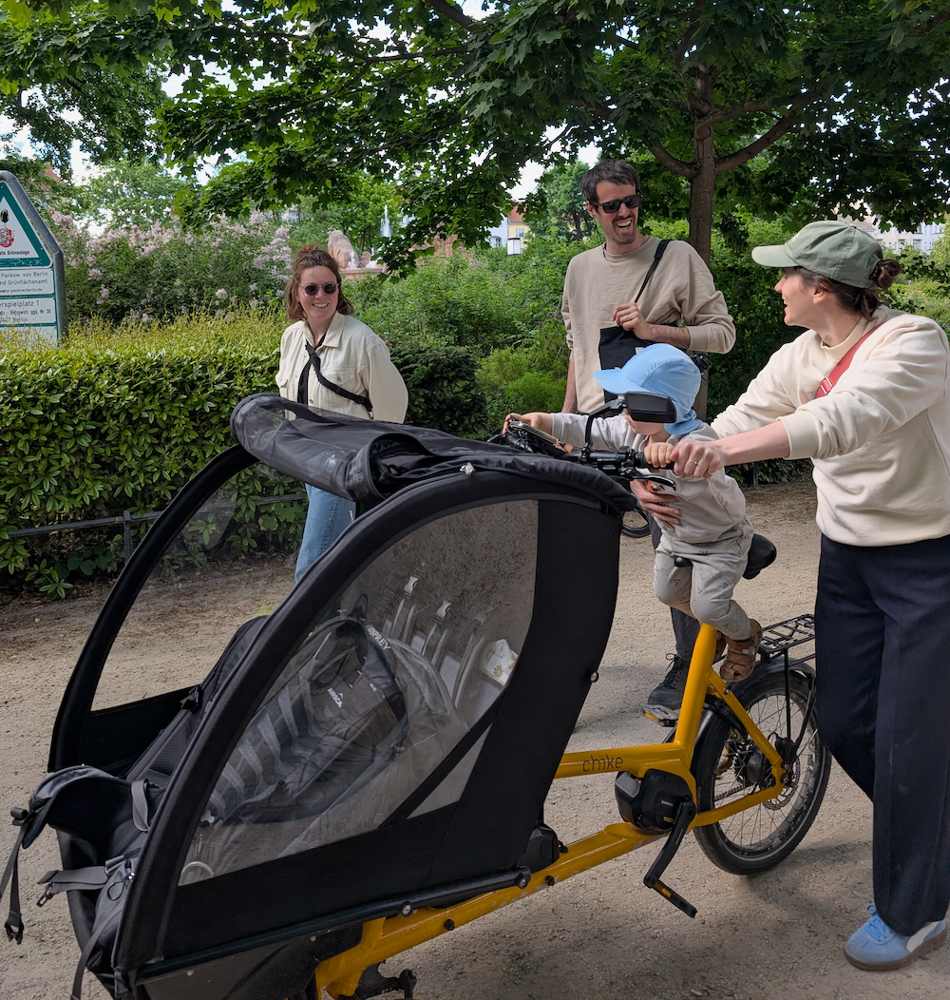
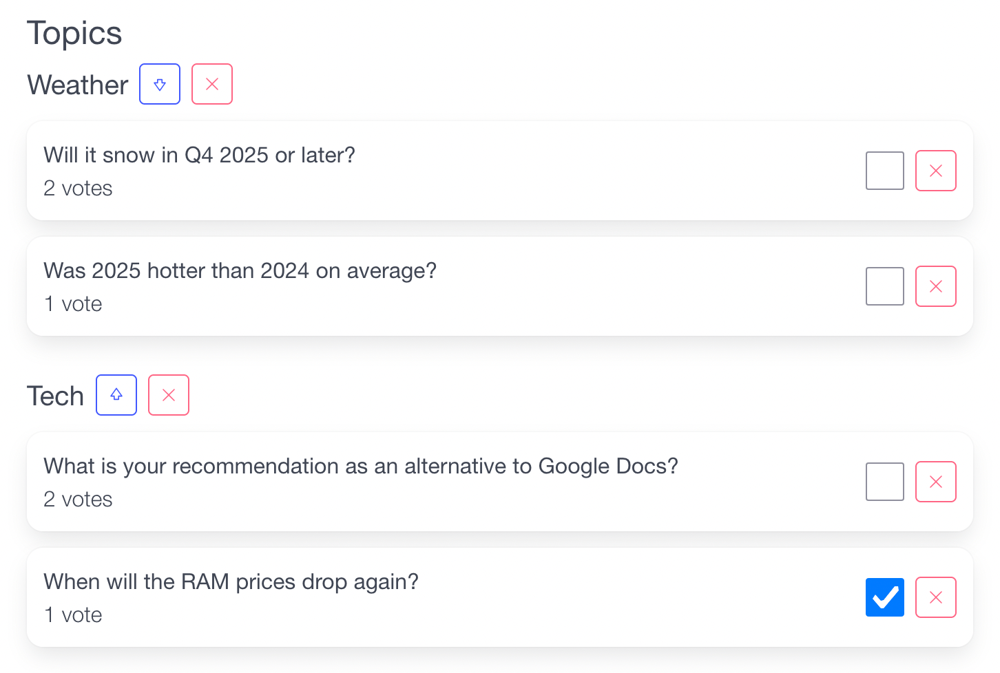
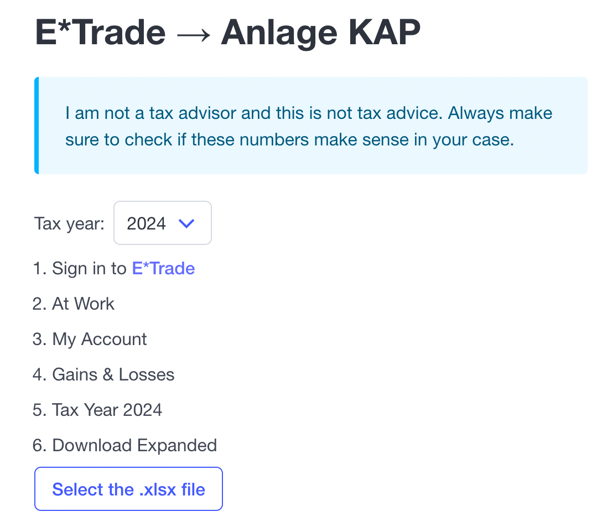

Bye, bye 2025 👋 

1. [Highlights](#highlights)
1. [Work](#work)
1. [Side projects](#side_projects)
1. [Goals for 2026](#goals_for_2026)
1. [TV shows](#tv)
1. [Movies](#movies)
1. [Books](#books)
1. [Music](#music)

## <a name="highlights">Highlights</a>

### Biking

We have hit the 3500km mark on our cargo bike in 2025. So on average we're using the cargo bike 1750km per year, roughly 150km per month. That number could be higher but we have replaced 99% of our grocery runs with grocery deliveries and our daily commute to the daycare is just 4km now. We take the cargo bike literally everywhere and we still see no use for a car. There were two occasions where we had to rent a car last year and those were both distances > 100km into cities that are hard to/not reachable by public transport.

I have also finally retired my 10 year old city bike and replaced it with a much lighter commuter bike. This has improved our longer bike journeys immensely! Since I have the new bike, I have cycled a lot more. I even cycled to the office a couple of times because the weather was so nice. The company works fully remote, so there's really no reason for me to go to the office otherwise ;)

One big biking highlight was being able to observe the arrival of the Tour de France in Paris in person. It's been on my bucket list since I've been a small child. The previous two years I missed it by literally hours. Even though it just takes 30 seconds for all riders to pass by you, it was a magical moment for me. We had a good spot right next to the Louvre. Friends managed to get seats at Montmartre which looked a lot more exciting but they were also completely soaked from the late rain fall.

### French / German
Our son is raised bi-lingual in German and French. Living in Germany, German is of course the dominant language and even though my wife only speaks French to my son, he would only reply in German for the first 2.5 years of his life. After the summer he started to use French words much more and at the end of December he started to switch between German and French depending on who he's talking to. It's magical to see this development.

My French also improves by proxy and by being exposed to a lot more French folks in Berlin. A low-key goal for 2026 is to do a French language assessment test and based on that level, improve my knowledge to the next level. Most (online-)French classes are scheduled at impossible times for me (10:00, 19:00) so it will be hard to find a class or rhythm that suits me. Speaking French at home will mostly confuse the little one but I guess it won't hurt so much to do it when we're hanging out with the French friends/family.

	
<strong>Medical events (low-light)</strong>

		In January, my son, who had just turned 2, had a major surgery with full anaesthesia. The surgery and the aftermath was incredibly taxing for our little family. My son wasn't allowed to jump or run which is pretty much everything that toddlers at that age do. On top of that, he wasn't able to enjoy the perfect snow we had in Berlin during that time. We did prepare lots of new games and toys for the two weeks which helped a lot. We're happy we decided to have the surgery in the end since his condition has resolved completely.

		The last two years, we were directly hit with major medical events and 2025 was no exception, hitting much closer than before. Here's to hoping that 2026 will be more quite in that regard.

## <a name="work">Work</a>
By the end of 2025 I finished my 4th year at Elastic. For almost all of those 4 years, I stayed in the same team with the same manager. Some team members were shuffled around on different products that our team owns but apart from that, it was 4 steady years. In the two final months of the year, I moved onto a team that owns only a single product.

My new team members are for the most part the same as before but for the first time at Elastic my manager changed. Still hard to believe how long I was with the same manager. At my previous job at SoundCloud, I had 8 managers in my 7 years there. That should tell you everything ;)

I'm happy with the new direction and the new product. It's almost like a platform product that hasn't been focused on in the last years but has become more important for the business. A lot of the foundational architecture needs to change to ensure we can achieve the goals we have set for ourselves in 2026.

## <a name="side_projects">Side projects</a>

### LiveQA

I'm not sure if I've talked about this project before on this site. When I joined the works council at my job, we needed a tool to capture questions anonymously during our works meetings. There are existing tools for this but they either require participants to sign up or are expensive. I wrote the first version of the tool in 2024 in [Remix](https://remix.run/) .

This year, when I wanted to extend it, I also took the time to migrate off Remix onto HTMX over Fastify with [fastify-vite](https://github.com/fastify/fastify-vite). For the UI, I switched from [Radix](https://www.radix-ui.com/) to [bulma](https://bulma.io/) which was as straight forward as it gets. The new stack is much simpler, faster and comes with a much smaller frontend footprint. The rewrite took a couple of weeks but it was worth it. This year I added the option to mark questions as resolved when they have been answered during the meeting.

([LiveQA on Github](https://github.com/janmonschke/liveqa-fastify-htmx))

### Tax document generator

This one is super specific to my tax/work situation. In 2025 I had to fill out a specific tax form for the first time. The one about income/loss from [RSU](https://en.wikipedia.org/wiki/Restricted_stock) sales. Since the RSU at work are managed on a US site and therefore I get reports in USD, there is a significant amount of manual calculation required to fill out the German tax form.

In order to make this process easier, I wrote a tool that does that calculation for you based on a CSV export from the trading tool. It came in quite handy and worked well enough so I shared it with my colleagues based in Germany. They were very happy and told me they're looking forward to the next tax year already, haha. Again, the tool is very specific to my employer and also is not tax advise ;)

([Tax tool on Github](https://github.com/janmonschke/etrade-tax-report-generator-de/))

### Self-hosting
If you've read my [Pi-Hole & Tailscale blog post](https://janmonschke.com/pi-hole-tailscale-my-gateway-into-self-hosting/) , you already know that I started self hosting a bunch of software. The post is teasing more self-hosting updates and I hope I will get to them in 2026. 

I started self-hosting software because I wanted to depend less on big tech, get my photos off Google Photos and save money. I think I achieved all of those. The "saving money" goal is partially achieved based on the upfront hardware cost, of course. By my estimate, I'll need 4 years for it have paid off (unless one of the SSDs dies, then it'll take longer).

For now, I'm hosting [Pi-hole](https://pi-hole.net/) (see blog post above), [Immich](https://immich.app/) (Google photos alternative),  [FreshRSS](https://www.freshrss.org/) (RSS feed aggregator), [Vaultwarden](https://github.com/dani-garcia/vaultwarden) (1Password alternative, backend for Bitwarden), [Vikunja](https://vikunja.io/) (Trello / Todo list alternative) and [Karakeep](https://karakeep.app/) (Pocket alternative). I also tried to host [NextCloud](https://github.com/nextcloud) in order to migrate off of Google Docs but that hasn't worked out. Partially because of the hardware requirements (my Asustor Drivestor 2 Pro Gen2 NAS has limited RAM) and partially because the migration of existing documents is painful.

So far I'm happy with my setup and I'm managing it all through [Portainer](https://www.portainer.io/). I subscribed to all of the project's Github Releases to stay up to date and once a month (sometimes less), I am doing a round of updates. And a round of backups, of course ;)

## <a name="goals_for_2026">Goals</a>

1. Take a French level assessment test, improve that level to the next level
  - This could be easy (A2->B1) or very hard (B1->B2). In any case, by simply trying, I will get better.
2. Play more board games
  - In December I started to meet with friends to semi-regularly play board games in a cafe. Some members of that group are leaving Berlin so not sure if this group will stick together or if I'll finally join my friend Felix's group.
3. Get back into bouldering
  - It's been a long time since I've bouldered an I miss it a lot. I've replaced the climbing sessions with a home gym but it's not the same experience whatsoever.

## <a name="lists">Lists</a>

### <a name="tv">TV Shows</a>

#### Pluribus
A classic Vince Gilligan show through and through. Slow-paced but captivating. At times it was hard to sympathise with the main character but that says more about me than the show-writing. Looking forward to how the story is resolved in season two.

#### Your friends and neighbors
I had not heard much about this show when it aired but I came across it while researching [this meme](https://www.tiktok.com/@thatgingerbrandon/video/7580815433779989790) (as you do in 2025). I would describe the show as "Desperate Housewives" but targeted at a male audience. It took me just over a week to finish it. John Ham's acting is excellent which makes it easy to look over some of the plot holes ;)

#### [Taskmaster (Season 19)](https://www.youtube.com/playlist?list=PLRWvNQVqAeWKt7kCUfEMdJi40m7H58CJd)
I had barely heard of Taskmaster before this year and always laughed it off as a silly show. When a colleague told me about how Jason Mantzoukas was brilliant in season 19, I became curious. Mantzoukas has played some of my favorite characters e.g. in Brooklyn 99 and Parks and Recreation. And he was SO funny in Taskmaster. The way he ripped apart the concept of the show and blamed the hosts for it was just BRILLIANT.

### <a name="movies">Movies</a>

#### One battle after another
I didn't really watch movies this year, or they were not memorable enough to pop back into my head. But "One battle after another" was excellent. It has the right mix of silliness/action/depth/message. Certainly one of the longer movies of the year but well worth it.

### <a name="books">Books</a>

#### The Murderbot Diaries
I had not heard about the book series before I saw the trailer for the TV show on Apple TV. I opted to read the books and to skip the series to pick it up later down the road. The books are awesome. If there's anything I needed to criticise is that they're too short, hehe. They have great humour and were at times hard to put down before I went to bed. Can't wait for more of the same in the upcoming books.
#### The Mercy Of Gods
The next book series by the authors of The Expanse series. I enjoyed the first book even though it took me some time to get through the first third of it. The "travel" portion was too long in my opinion but in hindsight seems necessary to understand the scale of the undertaking.
#### Dungeon Crawler Carl
This series was highly recommended by friends and it did not disappoint. A fun and witty main character, a cat and an intergalactic dungeon crawling TV event. What more can one want from a book series?

### <a name="music">Music</a>
#### [Grandbrothers - Elsewhere](https://music.youtube.com/playlist?list=OLAK5uy_npKeTSBPfe4r64BkEtHizQcpwynKYBynQ&si=_3N9YZA1lwIOTDRp)
2025 marked a big change for Grandbrothers. They extended their musical repertoire from just sounds that are made with a piano. Now they also add more common electronic music elements, though the piano sounds still play a very key role. Elsewhere is my favorite album release this year. I highly recommend [watching this pre-2025 video](https://youtu.be/kxW-B3qtvjA?t=1634) where they perform and explain their very interesting piano setup.
#### [Chromeo - Adult Contemporary](https://music.youtube.com/playlist?list=OLAK5uy_mqaaSKHF9KYff5JKIGZRc4Ecdv0ISqGGE&si=YwCa45V5hj7u-g6b)
Though released in 2024, I still have this one in heavy rotation. Instant mood-booster, funky, funny ear-wormy. There's a special edition pressing of their LP which I manged to snack in a record shop in Berlin this year. I still haven't managed to see Chromeo live but it's high on my list for 2026.
#### [Bilmuri](https://music.youtube.com/channel/UCGFdAlnCuH6ziQceyZvPnBw)
Bilmuri haven't released an album in 2025 but managed to place 5 tracks in [my top 20 of 2025](https://www.last.fm/user/pansN/library/tracks?from=1735686000&to=1767222000). ["Better Hell"](https://music.youtube.com/watch?v=0JMxXMorCgw) and ["Boutta Cashew"](https://music.youtube.com/watch?v=07Ovf1MrYe4&si=JXwY0T7j121cqcAd) are my go-to songs to start work in the morning. Instant kick of energy.
