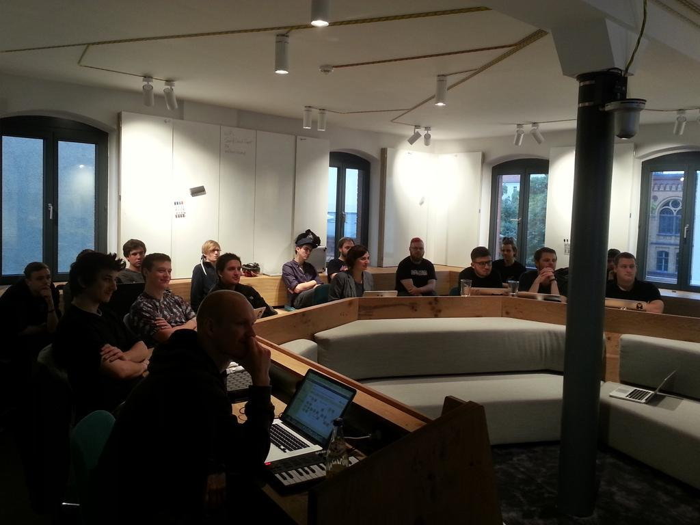
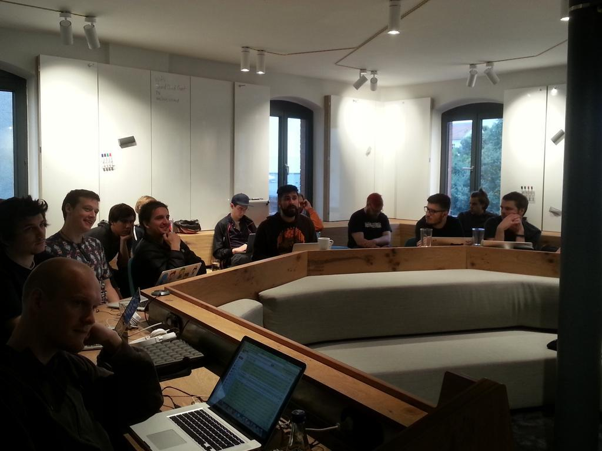
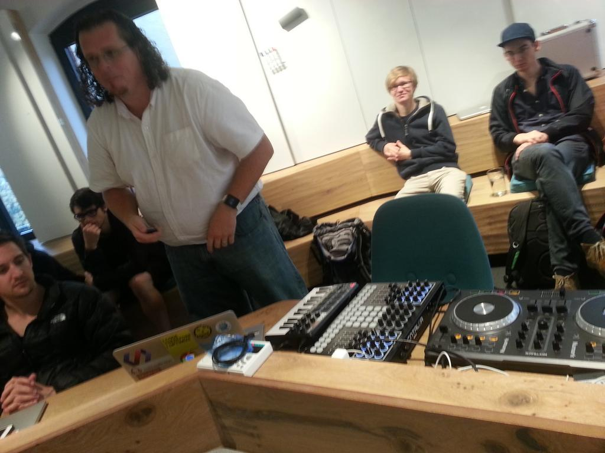
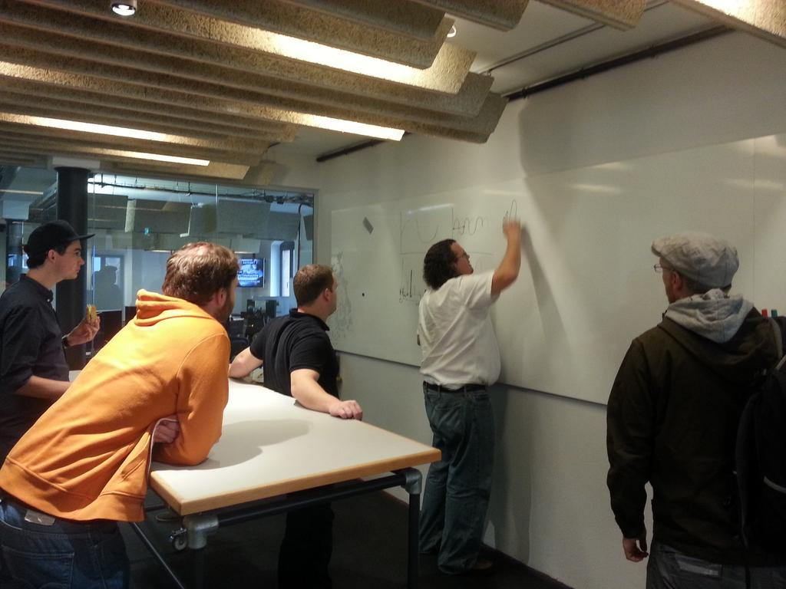

Earlier this year [Jan Lehnardt](https://twitter.com/janl), [Rin](https://twitter.com/rinpaku), [Robin](https://twitter.com/rmehner), [Tiffany](https://twitter.com/theophani) and me started to talk about making something special for the upcoming JSConf.eu (2014). Our idea was to organize a JSFest in Berlin around the three big conferences in September (Reject.JS, CSSConf.eu and JSConf.eu) which would host a range of web-related Meetups and Events.

For more than two years I have been obsessed with writing things with the Web Audio API which is becoming more and more stable and is supported by more and more browsers. I wanted to share my enthusiasm for this API by creating a Web Audio Hackathon during JSFest. Since I never organised an event before, Tiffany, who is familiar with all the processes that are needed to create big events like JSConf.eu, joined the organiser team and we started planning very soon.

The event took place at the SoundCloud HQ in Berlin in the wonderful classroom :)

We were able to have three amazing speakers from Mozilla and Google which introduced attendees to the Web Audio API and the Web Midi API. To be honest, I was [pretty](https://twitter.com/thedeftone/status/498877909525090304) [stoked](https://twitter.com/thedeftone/status/497779074585329664) to have the three of them talking at the event because they have always been my Web Audio Heroes <3

[Soledad Penadés](https://twitter.com/supersole) gave a very insightful introduction to the Web Audio API that was suited for both beginners and more advanced users. Since most of the 30 attendees were novice users this was perfect. I especially liked her very creative way of explaining the core features of the Web Audio API as [Super Powers](http://soledadpenades.com/files/t/berlin-webaudio-hackday-2014/#38) and her description and demonstration of LFOs as [spooky sounds](http://soledadpenades.com/files/t/berlin-webaudio-hackday-2014/#54) :) The slides can be found [here](http://soledadpenades.com/files/t/berlin-webaudio-hackday-2014/) and a recording of her talk from a Mozilla event can be found [here](https://air.mozilla.org/introduction-to-web-audio/).

Then, [Jordan Santell](https://twitter.com/jsantell) introduced us to the Web Audio debugging tools that he wrote for Firefox. I can still remember my first steps with the Web Audio API. My computer was making all these weird noises and my typical `debugger-driven` development work flow didn't work because audio is processed in its own thread and won't stop for debuggers. His tools would've made debugging much much easier! [Slides](http://jsantell.github.io/web-audio-tools-presentation/)

[Chris Wilson](https://twitter.com/cwilso) did the last talk and he introduced us to the Web Midi API. It took some time to set this talk up because he took a ton of devices to showcase the capabilities of the API (as you can see on the picture underneath). It was like as if he was the secret 4th member of [The Glitch Mob](https://soundcloud.com/theglitchmob)! His [Slides](http://webaudiodemos.appspot.com/slides/webmidi.html) are full of demos and are perfectly suitable if you want to get started with Midi on the web right away :)

After all the talks we had time for a little lunch altogether before we started the hack sessions. In addition to providing the location and drinks, SoundCloud sponsored tasty and healthy lunch snacks for all of us :)

Some groups formed during lunch and people started hacking right away. People were really focused and it was the perfect working atmosphere in the room. Sometimes there were weird noises coming from several computers when the attendees were trying out oscillators and audio parameters :) I did not really have time to work on a project on my own because I was still preparing my [slides](http://janmonschke.com/JSConf2014/) for [JSConf.eu](http://2014.jsconf.eu/speakers/#/speakers/jan-monschke-using-the-web-for-music-production-and-for-live-performances). In addition to the speakers, we also had coaches ([Chris](https://github.com/chrisguttandin), [Martin](https://twitter.com/woodworker) and [Jan](https://twitter.com/halfbyte)) helping the attendees with their projects. My favourite moment was when Chris Wilson was explaining details about audio, in the old fashioned way on a white board and people were gathering around him, listening closely:

After several hours of hacking it was time for the presentations! We had eight groups presenting their projects and here's the recording:

<iframe class="video-embed" width="560" height="315" src="//www.youtube.com/embed/atJgvEBn6qg" frameborder="0" allowfullscreen loading="lazy"></iframe>

Here's a list of all the projects that were presented if you don't have the time to watch the entire video. If you are an attendee and you want your project link on here, please contact me on [Twitter](https://twitter.com/thedeftone).

1. Jelle Akkerman ([github](https://github.com/jellea), [twitter](https://twitter.com/jellea)) – NoOsc was an experiment using NoFlo, trying to build something very visual and cool, super suitable for live-acts.
2. Guillaume Marty ([github](https://github.com/gmarty), [twitter](https://twitter.com/g_marty)) – a BPM detection algorithm, using the OfflineAudioContext
3. Erik Woitschig ([twitter](https://twitter.com/iam_bnz)) – Using SoundCloud as sample database
4. Daniel Roth, Jonathan Lundin ([twitter](https://twitter.com/mr_lundis), [github](https://github.com/mrlundis)), Felix Niklas ([twitter](https://twitter.com/mrflix), [github](https://github.com/mrflix)) – Oscillator reacting to mobile phone gyroscope.
5. Chris Greeff ([twitter](https://twitter.com/greevz), [github](https://github.com/chrisgreeff)), Nick Lockhart ([twitter](https://twitter.com/nickolockhart), [github](https://github.com/N1ck)) – Beaty Bird, a Flappy Bird clone that can is controlled by various audio inputs. Super Fun! – [source code](https://github.com/N1ck/beaty-bird) **(Second prize)**
6. Lisa Passing ([github](https://github.com/lislis), [twitter](https://twitter.com/lisapassing)) – One Hand Soundgame – [source code](https://github.com/lislis/onehandsoundgame) **(Third prize)**
7. Thomas Fett ([twitter](https://twitter.com/FettThomas), [github](https://github.com/ThomasFett)) – Remix at once – [source code](https://github.com/kollektivpp/remix-at-once) **(Fourth prize)**
8. Evan Sonderegger ([twitter](https://twitter.com/esonderegger), [github](https://github.com/esonderegger)) – Vector Scope in Web Audio API – [demo page](http://webaudiometers.rpy.xyz/#) **(First prize)**

We had three hardware prizes that were sponsored by Mozilla ([Akai LPK25](http://www.amazon.de/gp/product/B002M8GBDI/ref=oh_aui_detailpage_o02_s00?ie=UTF8&psc=1), [Akai LPD8](http://www.amazon.de/gp/product/B002M8EEW8/ref=oh_aui_detailpage_o01_s00?ie=UTF8&psc=1), [KORG nanoPAD2](http://www.amazon.de/gp/product/B004M8YPKM/ref=oh_aui_detailpage_o00_s00?ie=UTF8&psc=1)) and a special software price, a license for [Bitwig Studio](https://www.bitwig.com/en/bitwig-studio/overview.html) which was sponsored by Bitwig :)

Before we announced the winners, the attendees had the chance to get their hands on the amazing dinner that was provided by Google (while Martin and me were counting votes, almost starving ;)). Afterwards we still stayed in the classroom, having some drinks, talking about audio and web development. I was very excited to see another one of my Web Audio heroes popping by for the presentations: [Stuart Memo](https://twitter.com/stuartmemo) <3

### Post Scriptum

- Judging from the feedback from attendees, coaches and speakers it was an event that is definitely worth to be repeated in the near future :)
- One day after the Hackday in Berlin, there was the Web Music Hackday in Tokyo. We exchanged ideas when we were preparing the event and it looks like their event was a huge success and much bigger than the one in Berlin. You can see all demos and read about it in [Eiji Kitamura's blog post](http://blog.agektmr.com/2014/09/event-report-web-music-hackathon-3.html).
- I'm looking very much forward to the very first dedicated [Web Audio conference in January in Paris](http://wac.ircam.fr/). If you're a web audio developer or interested in the API, you should definitely join.
- Soledad wrote a very good blog post about the event on [her blog as well](http://soledadpenades.com/2014/09/26/berlin-web-audio-hack-day-2014/).
- We semi-announced an "official" Web Audio (community) logo made by [Martin](https://twitter.com/woodworker): 
