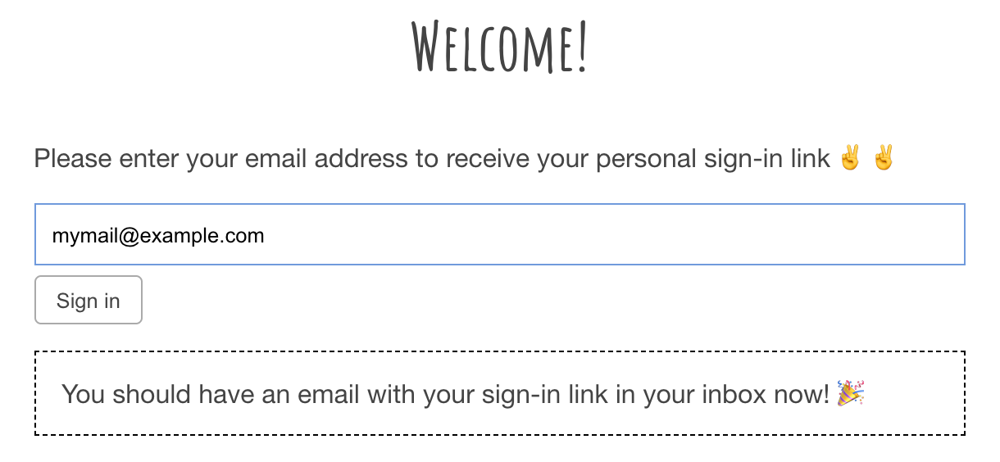

Titles:

- Building a wedding RSVP website in React and Firebase (\*)
- How I built my wedding website with React and Firebase
- Building a wedding RSVP in React and Firebase

- Why build a wedding RSVP
- authentication
- no server
- Building the interface

## Why Firebase?

I could have deployed my own database and server for this project but I decided to go with Firebase for several reasons. First of all, it saved me a lot of time because I did not have to set up the database and the server and it comes with many features. It allowed me to fully focus on building the website and not to worry about the backend side of things.

Secondly, it comes with authentication built right in. And that was probably the most important reason for me because I really did not want to have to write a super secure and battle-tested authentication system that stores all my relative's and my friend's passwords. Sure, I could have used an open source project for this, but then I would have still needed to spend time on that and then we would be back at my first point for using Firebase: not having to build a backend system.

Thirdly, Firebase offers Cloud Firestore, a real-time database. At first this might sound like a nice gimmick and nothing more but this feature was crucial for me to build a room booking service for our guests without a server 🤯.

On top of all that, you get these features for free for small websites and their documentation gets you up to speed super quickly!

## Using Firebase's Authentication module

Firebase offers several ways to add authentication to your project. The best choice for us was to use the email -> sign-in link method. What I like about this method is that it did not require our guests to chose a new password (or use their standard password for the millionth time) and this method also eliminates the whole `I forgot my password`-flow because there is no password.

This is how the flow works: A guest enters their e-mail on the website and they receive an email asking them to click on a sign-in link. That link then brings them back to the website and they are signed in 🎉.

### Adding e-mail authentication to your website

The first thing I did was to create a Firebase project and added the Firestore and Authentication modules in Firebase's console UI at [console.firebase.google.com](https://console.firebase.google.com). The [setup-guide](https://firebase.google.com/docs/web/setup) explains all of these steps in detail.

I abstracted the initialization of Firebase and it's modules into a small module that I import whenever I need access to Firebase.

```js
// data/firebase.js
import * as firebase from 'firebase/app';
import 'firebase/auth';
import 'firebase/firestore';

export function getFirebase() {
  // only initialize once
  if (firebase.apps.length === 0) {
    firebase.initializeApp({
      // TODO: add your config
    });
  }

  return firebase;
}
```

The next building block is the website's router. One route is needed for the sign-in form (`<SignIn />`) and another one is used as the `callback-url` for the sign-in links (`<EmailLink />`). The router library that I used is [react-router](https://reacttraining.com/react-router/) but you can use whichever routing library you prefer.

```jsx
// App.js
import React from 'react';
import { BrowserRouter, Switch, Route } from 'react-router-dom';
import { SignIn, EmailLink } from './routes';

export default function App() {
  return (
    <BrowserRouter>
      <Switch>
        <Route path="/sign-in">
          <SignIn />
        </Route>
        <Route path="/email-link">
          <EmailLink />
        </Route>
      </Switch>
    </BrowserRouter>
  );
}
```

In the `<SignIn />` component we are asking for the user's e-mail address and provide feedback when the email is submitted.

```jsx
// routes/SignIn.js
import React, { useCallback, useState } from 'react';

// A simplified e-mail RegEx, please don't use it in production.
// Use a better one e.g. from https://emailregex.com/.
const emailRegex = /.+@.+\.\w+/;

export function EmailForm() {
  const [email, setEmail] = useState({
    value: '',
    valid: false
  });
  const [emailSent, setEmailSent] = useState(false);
```

The component keeps track of the user's input and if the form has been submitted. The user input is validated with a regular expression so that users cannot submit invalid email addresses.

```jsx
const onUpdate = useCallback(event => {
  const { value } = event.currentTarget;
  setEmail({
    value,
    isValid: emailRegex.test(value)
  });
}, []);
```

`onUpdate` takes care of syncing the component state with the user's actual input and running the 'validation'.

```jsx
const onSubmit = useCallback(
  event => {
    event.preventDefault();
    if (email.isValid) {
      sendSignInLinkToEmail(email)
        .then(() => setEmailSent(true))
        .catch(error => {
          alert('Could not sign you in', error);
        });
    }
  },
  [email]
);
```

`onSubmit` checks if the e-mail is valid, starts the sign-in process and triggers a UI update when the e-mail has been sent.

```jsx
  return (
    <div>
      <form onSubmit={onSubmit}>
        <input
          type="email"
          onChange={onUpdate}
          onKeyUp={onUpdate}
          onInput={onUpdate}
        />
        <button disabled={!email.isValid}>Sign in</button>
      </form>
      {emailSent && <p>Check your mailbox for your sign-in link</p>}
    </div>
  );
}
```

`onUpdate` is executed for `onChange` to update when the input blurs, for `onKeyUp` to update the button's disabled state while typing and for `onInput` to update when input comes in from the browser's autocompletion.

If you add a little bit of CSS and some custom copy, the form will look like this:



It is important to give the user instructions on what to do next, because not everyone has come across a sign-in form that works without passwords. When the form is submitted, the Firebase authentication module is called from the `sendSignInLinkToEmail` method.

```js
// data/sign-in.js
export function sendSignInLinkToEmail(email) {
  // Save the email locally so you don't need to ask the user for it again
  // when they open the link on the same device.
  window.localStorage.setItem('emailForSignIn', email);

  const options = {
    // The URL you want to redirect back to. The domain for this
    // URL must be whitelisted in the Firebase Console.
    url: `${window.location.origin}/email-link`,
    handleCodeInApp: true
  };

  return firebase.auth().sendSignInLinkToEmail(email, options);
}
```

This method does two import things:

1. It stores the user's email in local storage, which is important for identifying the user when they open the site from the sign-in link that they receive via e-mail
2. It initiates the Firebase sign-in link authentication. For that, it tells Firebase the url of this website that the link should lead to. In our case that is `/email-link`. It is important that the domain for that URL is whitelisted in the Firebase console!

You might wonder about the content of the e-mail that has been sent to the user because we have not provided neither an e-mail title, nor an e-mail text. And this is where this sign-in method falls short a bit because you cannot change the e-mail text. You can see the content of that e-mail in your Firebase console and you can change the sender's e-mail address but the text os off-limits for you. I am not sure why Firebase does not give you control over this text but I assume it has to do with spam-protection.

The user should now have received a sign-in link e-mail via e-mail that leads them to `/email-link`, the final piece of the Firebase authentication puzzle.

```jsx
// routes/EmailLink.js
import React, { useEffect, useState } from 'react';
import { signInWithEmail } from '../data/sign-in';

export function EmailLink() {
  const [signedIn, setSignedIn] = useState(false);

  useEffect(() => {
    signInWithEmail()
      .then(() => setSignedIn(true))
      .catch(() => alert('Could not sign you in'));
  }, []);

  return signedIn ? (
    <Redirect
      to={{
        pathname: '/rsvp'
      }}
    />
  ) : (
    'Loading...'
  );
}
```

The component for the `/email-link` route is pretty simple because all of the sign-in-related logic is abstracted within `signInWithEmail`. The main purpose of this component is to render a loading screen while the Firebase SDK authenticates the user and when the user is signed in, to redirect to the `/rsvp` route (that we have not built yet ;)).

```jsx
// data/sign-in.js
import { getOrCreateUser } from './user';

export function signInWithEmail() {
  const email = window.localStorage.getItem('emailForSignIn');

  return firebase
    .auth()
    .signInWithEmailLink(email, window.location.href)
    .then(result => getOrCreateUser(result.user));
}
```

In `signInWithEmail` we read out the email address the user has entered. We then pass it along with the current URL to the `signInWithEmailLink` method of the Firebase SDK. That method will then take care of checking of signing the user in. It is not explained how Firebase does this but I suspect they look at cookies that are set from the redirected sign-in link and compare them to query params that are passed to the current route.

If all goes well, Firebase then returns a user object and the user is redirected to the actual RSVP website 🎉.

## Firebase Cloud Firestore basics

Before I talk about how I built the RSVP website, I would like to go over some of the basics for Firebase's Cloud Firestore database. The `user` object that we just received from the auth SDK is not actually stored in that database and its main purpose is to [represent a user's metadata](https://firebase.google.com/docs/reference/js/firebase.User#updateprofile) (e.g. a `displayName` or a `photoURL`). That information is not suitable to build our website so we need to transfer the user session object into our database.

If you look at the previous code sample, you might notice the `getOrCreateUser` method. It takes the user session and creates a new user object in our database or it returns the user object for this session if a user with that id already exists. Let's have a closer look at how it does that:

```js
// data/user.js
import firebase from './firebase';

function usersCollection() {
  return firebase.firestore().collection('users');
}
```

All users will be stored in a `collection` that we call `users`. You can think of a Firebase `collection` as a remote [Set](https://developer.mozilla.org/docs/Web/JavaScript/Reference/Global_Objects/Set) that maps user IDs to JSON objects. Collections also offer methods to search for objects and to return real-time updates about changes.

```js
function userDoc(userId) {
  return usersCollection().doc(userId);
}
```

Objects that are stored in a `collection` are called `documents`. Think of them as `JSON Objects` for now. A document can be read from a collection by calling the `doc(id)` method.

```js
export function getOrCreateUser({ id, email }) {
  const userDocRef = userDoc(id);
  return userDocRef.get().then(user => {
    if (user && user.exists) {
      return userDocRef;
    } else {
      return userDocRef.set({ email }).then(() => userDocRef);
    }
  });
}
```

The `getOrCreateUser` method tries to fetch the user object with the id that is associated to the user's session. The first time this method is executed, `user.exists` will be `false` because the user has just signed in and it did not exist in the database before. In that case the method then executes `userDocRef.set({ email })` which will create a new user document in the collection for the provided id. That document's content will only be the user's email address for now but we can use it later to attach more information to it.

> If you have never worked with document-based databases before or your background is mainly in relational-databases, this might all look strange because at no point have we set up a database or defined a table structure.<br/>Cloud Firestore is a flexible database, meaning that it does not need a pre-defined structure. You can create collections on-the-fly and documents within a collection can have very different shapes.

## Building the RSVP form

Now that our guests are authenticated, we can build the actual RSVP form. This section is less about how to build a great looking website and is more focused on how to capture the user details and store them in Firebase.

### Which data to capture

So far we have managed to enable users to sign in and we can create and read user objects. The next step is to make a list of all the information that we need to know from our guests. In our case we want to know who is able to attend and who is not able to attend. For the guests that are able to attend we need to know about all the guests of their party. For each guest in their party we need to know their name and about food requirements that we need to accommodate for.

On that basis, I came up with the following data structure:

```json
{
  "id": "398heirfue8f7347fhe4fh8394hf",
  "email": "johnathan@doe.com",
  "isComing": true, // undefined -> unanswered
  "guests": {
    // sub-collection
    "93283498h34r9384hr": {
      "firstName": "John",
      "lastName": "Doe",
      "foodReq": "nut allergy"
    }
  }
}
```

For each user account I am storing the user's email address and the `isComing` property that indicates if the user has replied to the RSVP (`isComing !== undefined`) and their RSVP response (`isComing === true/false`). It is important to not default `isComing` to `false` because that would result in many false-negative RSVP responses in the admin interface that we will build later.

In addition to their RSVP response, we are storing our guest's `guests` in a sub-collection. In Firestore, each document is part of a collection but each document can also have collections of their own. This makes deleting and changing documents a lot easier than managing an array of guests. The guest document itself then is made up of a `firstName`, a `lastName` and an optional string explaining food requirements.

### Creating and deleting users

Before we implement the interface, let's quickly add some Firestore helpers to add an remove guests.

```js
// data/guests.js
function guestsCollection(userId) {
  return userDoc(userId).collection('guests');
}
```

`userDoc` we already defined in an example above and we can reuse it here to get a reference to the `guests` collection of a user.

```js
export function addGuestToUser(guest, userId) {
  return guestsCollection(userId).add({
    ...guest,
    userId
  });
}
```

Adding a guest to that collection can be done using the `add` method. Again, no schema is enforced here and we could add arbitrary objects to that collection.

```js
export function removeGuest(userId, guestId) {
  return guestsCollection(userId)
    .doc(guestId)
    .delete();
}
```

In order to remove a guest, we first get a reference to the guest document from the `guestsCollection` by calling the `doc(id)` method. That reference object has a `delete` function that we can then use to remove the guest.

### Rendering the RSVP form

```jsx
// components/RSVPForm.jsx

function RSVPForm({ user }) {
  const setIsComing = useCallback(event => {
    event.preventDefault();
    user.ref.update({
      isComing: event.target.value === 'coming';
    });
  }
  , [user]);
```

`setIsComing` is called when the `form` changes and it sets the user's `isComing` value based on the current value of the form. It does that by calling the `update` function of the user's document reference that is passed in to this component.

> Document references also have a `set()` method but that one will change the structure of the document to whatever you are passing in as the first parameter and it's easy to accidentally override a document like that.<br/>If you wanted to achieve the above result with `set` you would have to call it with all values: `set({ ...user.data(), isComing: true })`.

```jsx
  const { isComing } = user.data();
  const hasRSVPed = isComing !== undefined;
  return (
    <form onChange={setIsComing}>
      <label>
        <input type="radio" name="isComing" value="coming" checked={isComing} />
        Would love to come
      </label>
      <label>
        <input
          type="radio"
          name="isComing"
          value="notComing"
          checked={hasRSVPed && !isComing}
        />
        Can't make it
      </label>
    </form>
  );
}
```

> In Firestore, a document's values can be read by calling it's `data()` method.

The form itself is kept rather simple. First, we need to check if the user has already responded which, as described above, is the case when their `isComing` value is undefined. There are two radio inputs representing the RSVP options. When the user has not replied, none of them will be checked and if they have replied, the correct one will be checked by default. The form's `onChange` is responsible for calling the `setIsComing` callback which then updates the value in our Firestore database. Et voilà, the RSVP form is done!

> The update of the RSVP will feel instantaneous to the user, because Firestore uses optimistic updates. That means that it will apply the change locally right after the interaction and then send the change request to the database. If the update fails, it will reset the local value to what it was before. `update` and `set` return `Promises` that you can use to react to database failures.

### Rendering the guest form

As described before, we also want to ask our guests for all members of their party. We therefore need to implement two components. One to list a user's guests and one to add a new guest.

```jsx
// components/GuestList.jsx

function GuestList({ user }) {
  const [guests, setGuests] = useState([]);

  useEffect(() =>
    guestsCollection(user.id).onSnapshot({ docs } => setGuests(docs))
  , [user]);
```

The `GuestList` fetches the user's guest by calling `onSnapshot` on the `guestsCollection`. `onSnapshot` invokes a fetch from Firestore and will call the passed in function with the result. In our case, we are only interested in the `docs` of that result which will be stored in the component's state. `onSnapshot` is also called when the `guestsCollection` changes locally or remotely. I will go into more detail on remote real-time updates in the next posts.

```jsx
<ul>
  {guests.map(guestRef => {
    const { firstName, lastName, diet } = guestRef.data();

    const name = `${firstName} ${lastName}`;
    const display = `${name} - ${diet}`;

    return (
      <li key={guestRef.id}>
        <span>{display}</span>
        <button onClick={() => removeGuest(user.id, guestRef.id)}>X</button>
      </li>
    );
  })}
</ul>
```

For the actual rendering of the `GuestList` we are mapping over the guests and use the `data()` method to extract the information that we want to render. In this case we are rendering the full name and the dietary requirements in a list. Each guest also has a button next to them that allows our user to remove the guest. The button is using the `removeGuest()` function that we had defined before.

//TODO: useReducer?

```jsx
<form onSubmit={this.addGuest} ref={form => (this.form = form)}>
  <input
    type="text"
    ref={firstNameInput =>
      (this.firstNameInput = firstNameInput && firstNameInput.input)
    }
    placeholder="First name"
    required
  />
  <input
    type="text"
    ref={lastNameInput =>
      (this.lastNameInput = lastNameInput && lastNameInput.input)
    }
    placeholder="Last name"
    required
  />
  <input
    type="text"
    ref={dietInput => (this.dietInput = dietInput && dietInput.input)}
    placeholder="Dietary requirements"
  />
  <input type="submit">Add guest</input>
</form>
```

show form, show code, explain, cool

## TODO:

- shoot video of auth- and user-input-flow and attach to the beginning of the post
- add e-mail list sign-up form?

## Next posts

1. Admin interface
1. Using Firebase and React to build a hotel room booking system
1. Security: Managing Firebase database access, Routes that are only accessible by signed-in users

- use playlist feature as example?
  - don't want to expose user's music taste to other users?
  - more people post when they are anonymous?
