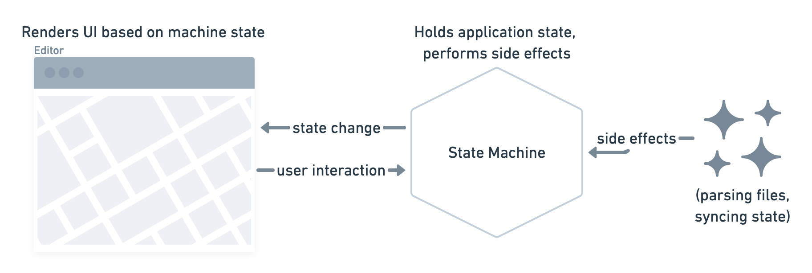

<a href="https://janmonschke.com/gpx-editor" target="_blank">
<small>(try out the editor)</small></a>

When [I go hiking](https://aweekinthewoods.com/france/auvergne/), I usually record the trip with this battery-efficient [GPS Logger app](https://gpslogger.app/) 🏕. Battery-efficiency is important because there's often no possibility to charge my phone on a multi-day hike. The app let's me define custom intervals at which it records a GPS point. I usually set the interval to somewhere between 45 seconds and a minute. This resolution is accurate enough for recordings of walks and it does not add too much strain on my battery.

The app is requesting a GPS fix at certain points in an interval and disables GPS in-between recordings. This sometimes results in inaccurate readings of elevation and GPS locations. At least in my case and on my current phone.This in turn means that when I upload the recording to a tour website like [komoot](https://www.komoot.com/user/214500264344) the stats can be quite off and people that use my GPS recording might take wrong turns due to the inaccurate GPS 🛰.

For that reason I built a GPX editor which allows me to adjust the recorded points and strip out the elevation values. The cool thing about komoot is that they add the elevation info to your route if you don't provide any. They are using topology data that is a more accurate than my phone's recording.

My usual approach to building a small app like that would be to spin up [create-react-app](https://create-react-app.dev/) and code away. In the case of this small editor it did feel like overkill. I was also interested in trying out a new kind of app setup. Due to my previous experience with [XState](https://xstate.js.org/docs/) I wanted to use it to drive the business logic of the editor. For the rendering I wanted to use [list-html](https://lit-html.polymer-project.org/guide) which is tiny and super easy-to-use templating library.

The last new building-block of my setup was [parcel](https://parceljs.org/). Previously I had pretty much exclusively used [webpack](https://webpack.js.org/) and I was in the mood for trying out something new. I was especially curious to see if parcel really required zero configuration (spoiler: It really did not need any configuration 🎉).



The diagram above shows the application architecture. At the core of it is the state machine. It holds all of the application's state, it transitions based on user interaction and performs side-effects when necessary. Side-effects may also cause transitions e.g. in case of a file parsing error.

The user interface reacts to the state machine's transitions. Depending on the current state, it will render the appropriate component. It also acts as the glue-code between user interaction and the machine:

```ts
editor.onTransition((state) => {
  switch (state.value) {
    case "choose-gpx":
      const onFileSelected =
        (file) => machine.send({ type: "FILE_SELECTED", file });

      return render(ChooseFile({ onFileSelected }), contentElement);
    case "export-gpx":
      return render(Export(), contentElement);
  }
})
```

For a given state of the machine, in this case `choose-gpx` and `export-gpx`, the application renders a different component. The application also defines callbacks for the components. These callbacks are executed on user interaction and they result in state transitions (and their side-effects e.g. file parsing).

```ts
type Props = {
  onFileSelected: (file: File) => void;
};

export const ChooseFile = (props: Props) =>
html`
  <form>
    <label>
      <input
        type="file"
        @change=${(event: Event) =>
          props.onFileSelected(
            (event.currentTarget as HTMLInputElement).files[0]
          )}
      />
      Select a .gpx file
    </label>
  </form>`;
```

Check out the  `ChooseFile` component as an example. It renders a file input and calls the `onFileSelected` callback when a file gets selected. This is the same callback as we saw before in the application file. When the callback is invoked, the event is causing a transition of the state machine. Which in turn will then result in the render of a different component. Bonus: I like how this component almost looks like a React component ⚛.


This diagram shows all of the state machine's states, its transitions and side-effects. The XState visualizer at [stately.ai/viz](https://stately.ai/viz) is just grat. You paste the machine's code and it will render an interactive diagram of your machine. It let's you play around with the transitions, send custom events and save it to your account in case you want to show it to someone else. Pretty much every time I'm writing a state machine, I start inside this visualizer. It makes prototyping a workflow super easy.

And that is pretty much everything there is to say about the editor. It uses [Leaflet](https://leafletjs.com/) as the map renderer and [spectre.css](https://picturepan2.github.io/spectre/) as a light-weight CSS component framework.

Overall I'm very happy with the current setup. I feel productive, the state machine adds a great structure and lit-html is a great renderer for small applications like this one. I will definitely reuse this stack in other applications.

If you are insterested in trying out the editor yourself, you can find it on https://janmonschke.com/gpx-editor. The code is up on GitHub at [janmonschke/gpx-editor](https://github.com/janmonschke/gpx-editor).
