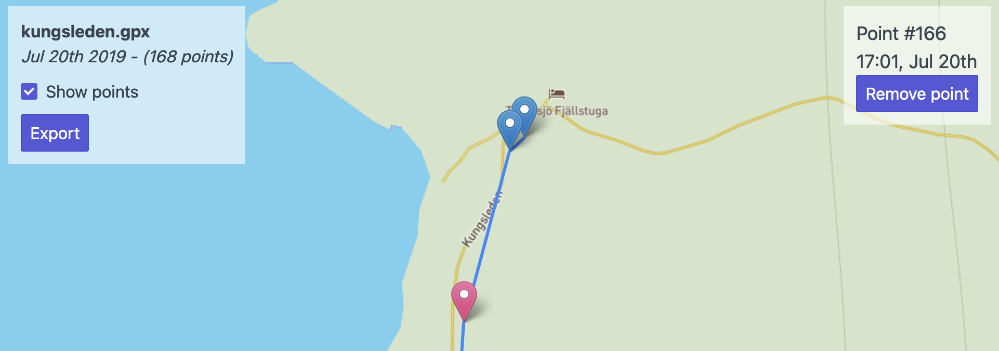
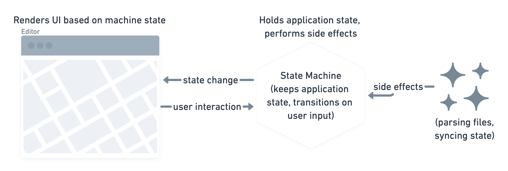
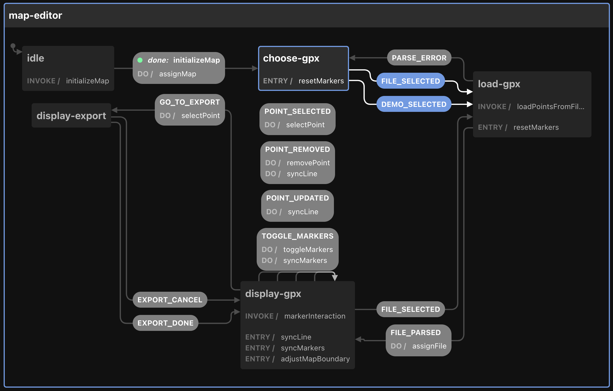

When [I go hiking](https://aweekinthewoods.com/france/auvergne/), I am recording the trek with this battery efficient [GPS Logger app](https://gpslogger.app/) 🏕. Battery efficiency is important because there's often no way to charge my phone on a multi-day hike. The app let's me define custom intervals in which it records a GPS point which I usually set to somewhere betwwen 45 seconds and a minute. That resolution is accurate enough for recordings of walks and it does not add too much strain on my battery.

So the app is requesting a GPS fix at certain points in an interval and disables GPS in between the recordings. This results in inaccurate readings of elevation and sometimes inaccurate GPS locations. At least in my case and on my current phone. Which in turn means that when I upload the recording to a tour website like [komoot](https://www.komoot.com/user/214500264344) the stats can be quite off and people that use my GPS recording to go on the same tour might take wrong turns due to the inaccurate GPS 🛰.

For that reason I built a GPX editor which allows me to adjust the recorded points and then strip out the elevation recording. The cool thing about komoot is that they add the elevation info to your route if you don't provide any. The info is based on topology data that is a more accurate than my phone's recording.

My usual approach to building a small aoo like that would be to spin up [create-react-app](https://create-react-app.dev/) and code away. In the case of this small editor it did feel like overkill though and I was also interested in trying out a new kind of app setup. Due to my previous experience with [XState](https://xstate.js.org/docs/) I wanted to use it to drive the busness logic of the editor. For the rendering I used [list-html](https://lit-html.polymer-project.org/guide) which is tiny and super easy-to-use (when you're already familiar with sth. like jsx). The last new building-block of my setup was [parcel](https://parceljs.org/). Previously I had pretty much exclusively used [webpack](https://webpack.js.org/) and I was in the mood for trying out something new. I was also curious to see if parcel really required zero configuration (spoiler: It really did not need any configuration 🎉).

- app logic diagram
- state machine diagram
- deploy to github pages
