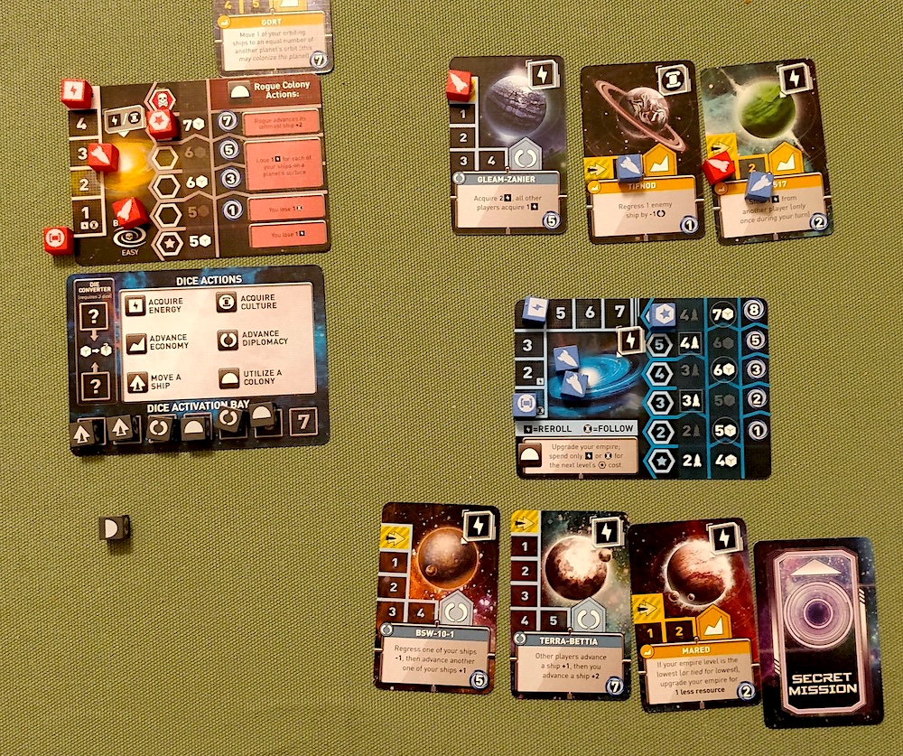

## Side projects

### Somewhere

I managed to finish the animations for the loading screen which also act as onboarding. You can check them out in the video below. It's always great to see how powerful a couple of simple CSS animations and transitions can be. I'm very pleased with the result. 🤩

<video controls loop alt="Somewhere loading animation">
  <source src="./04-somewhere-animation.mp4" type="video/mp4" />
</video>

### Ping

I spent only an hour or two on ping this week. I made the sign up screen component more generic to also support sign in. Next step in the proof of concept is to build a basic version of the screen that will let users collaborate.

Oh and I looked into [callable functions on Firebase](https://firebase.google.com/docs/functions/callable). I'm currently using Vercel's serverless functions but I'm pretty sure that after the proof of concept I will port those to callable functions. They are just a tad more convenient to work with when you are already using other Firebase products. 🔥

## Life

We are moving to a new apartment at the end of March and it's really hard to plan a kitchen when all kitchen studios are closed. Pretty much our only option is the IKEA kitchen planner website.

It's a pretty powerful tool and it must be one hell of a big engineering project. You can build your entire kitchen, it renders an interactive 3D model, checks for potential issues, tells you the price, has a huge catalogue of items etc.

I looked under the hood a bit and it seems to be a [WebAssembly](https://en.wikipedia.org/wiki/WebAssembly) project which made me even more curious 🤯.

Also: IKEA and Web**Assembly**...get it? 😂

Right, I will see myself out 🏃‍♂️

## Entertainment

I watched a lot of The Expanse over the weekend and am almost at the end of the current season. To slow me down a bit, I started to read [The end of all things](https://www.goodreads.com/book/show/23168809-the-end-of-all-things) by John Scalzi. Which also is the the final novel in its own series (the Old Man's war). It's always so annoying to finish a series 😅 I really need to find new a sci-fi book and/or TV show. Maybe there is something similar to The Expanse?

Staying true to this week's subliminal sci-fi topic, we played [(Ultra) Tiny Epic Galaxies](https://boardgamegeek.com/boardgame/285826/ultra-tiny-epic-galaxies). I love this game for so many reasons. It's both single- and multiplayer, you can adjust the difficulty level and there are so many different planets and abilities to discover. It makes every round unique. Also, the _ultra_ tiny version of this game fits into my pocket 😄

## Song of the week

This week I have a Steve Reich remix for you. My favorite remix of "[Music For 18 Musicians (Section VI)](https://soundcloud.com/steve-reich-official/music-for-18-musicians)". This one is created by Joe Acheson, the creative mastermind behind [Hidden Orchestra](https://soundcloud.com/hiddenorchestra). I could not find the track on its own though, only embedded in other mixtapes. It plays from 12:52 in this mix:

<iframe width="100%" height="300" scrolling="no" frameborder="no"src="https://w.soundcloud.com/player/?url=https%3A//api.soundcloud.com/tracks/80898659&color=%23ff5500&auto_play=false&hide_related=false&show_comments=true&show_user=true&show_reposts=false&show_teaser=true&visual=true"></iframe>
