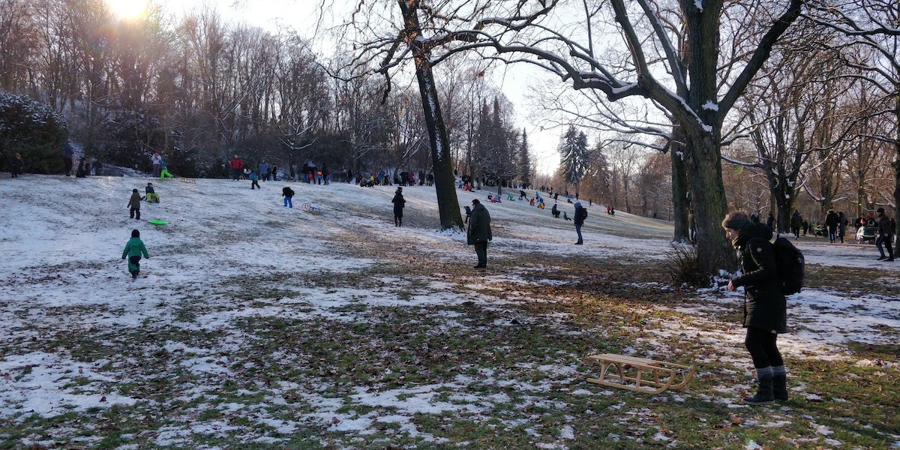

## Side Projects

### Ping

I made a lot of progress on the collaborative screen in Ping. The main achievement there was that I added a video call component (built with [Twilio Programmable Video](https://www.twilio.com/docs/video)) 🎥. This involved understanding the Twilio SDK for the client, which handles the room session and displays the video call, and the server, which creates rooms and grants users access to specific rooms.

<video controls loop alt="select camera flow">
  <source src="./05-ping-select-camera.mp4" type="video/mp4" />
</video>

I learned about the [enumerateDevices API](https://developer.mozilla.org/en-US/docs/Web/API/MediaDevices/enumerateDevices) and how media devices are represented. This allowed me to build the flow above that selects preferred devices. The video loops and will not show the screen that comes after clicking the `Join` button. That screen I will keep secret for now 😄.

One problem I was struggling with was how Twilio is handling presence in video calls. When a participant closes the tab, no event is fired for other participants that indicates that the person has left the call. I'm used to working with WebSockets and it's pretty straight-forward to determine when a socket disconnects there. It might be a whole different beast in WebRTC-land.

Anyways, this gave me the chance to revisit my knowledge on the [`onbeforeunload`](https://developer.mozilla.org/en-US/docs/Web/API/WindowEventHandlers/onbeforeunload) event and how it allows developers to prevent accidental tab closures. In case the user did want to disconnect from the video call and close the tab, I am now cleaning up the session in that handler.

## Life

It was a low-energy kind of week with temperatures way below freezing and lots of snow ⛄️. The sun was out a lot though and it makes me look forward to the upcoming spring season. It felt great to walk in the parks in Berlin. The hills full of kids on their sleighs. 🛷

## Entertainment

We found [The laundromat](<https://en.wikipedia.org/wiki/The_Laundromat_(film)>) when we searched for an easy-going comedy on Netflix. It turned out to not be that easy-going at all. It's definitely a comedy but there is quite a lot of critique of our financial markets in it 💹. As you would expect from a movie that is based on a book about the [panama papers](https://en.wikipedia.org/wiki/Panama_Papers). I found it especially interesting to watch in the week where everybody was talking about the [GameStop short squeeze](https://en.wikipedia.org/wiki/GameStop_short_squeeze). 🍿

## Song of the week

Last week [Delvon Lamarr Organ Trio](https://delvonlamarrorgantrio.bandcamp.com/) released their new album _I told you so_. I have been waiting for this one for so long. I randomly stumbled upon this band on YouTube where I saw [their version of "Move on up"](https://www.youtube.com/watch?v=jhicDUgXyNg). The energy and groove of the organ and the virtuos play on the guitar had me instantly hooked. They were my favorite live band in 2019 and I hope they come back once this whole pandemic situation settles. My favorite track on their new album is _Fo Sho_:

<iframe style="border: 0; width: 100%; height: 120px;" src="https://bandcamp.com/EmbeddedPlayer/album=3476419932/size=large/bgcol=ffffff/linkcol=0687f5/tracklist=false/artwork=small/track=4087215489/transparent=true/" seamless><a href="https://delvonlamarrorgantrio.bandcamp.com/album/i-told-you-so">I Told You So by Delvon Lamarr Organ Trio</a></iframe>
