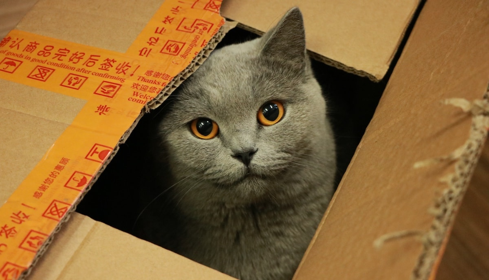

## Life

I'm in the middle of a move, so my updates might not be as thourough or interesting in the next couple of weeks but I will keep up the habbit 😊.

We did get back into listening to audio books this week. Turns out that packing moving boxes is the perfect activity for audio books. We are still listening to [Sapiens](https://en.wikipedia.org/wiki/Sapiens:_A_Brief_History_of_Humankind). It's a whooping 15h long 🤓

## Side projects

### Somewhere

Not much to show for this week on somewhere. I am adding legal pages, fixing small issues in the responsive layout and trying to add a 3d scene to the landing page. A placeholder image is shown while the scene, and the whole 3d engine, is loaded asynchronously. I am currently struggling to fade nicely between the two because the perspective of the scene and the placeholder don't match. Will ask for help from the artist 👨‍🎨

Also the scene is 8mb and it's pretty much empty. We probably need to tick some extra boxes when exporting the files 😅

### Ping

Didn't manage to spend any time on ping this week due to move preparations. The only thing that I did was to buy this [course on NextJS and Firebase](https://fireship.io/courses/react-next-firebase/) from [Fireship](https://www.youtube.com/channel/UCsBjURrPoezykLs9EqgamOA). I love their YouTube videos and the course promises to be similar to their videos.

Unrelated/Related: I love that there are so many creators selling their courses/books/workshops independently these days 🤩

I have not yet managed to watch a lot of the course but I hope to get to that in the next weeks. Probably after the move.

## Song of the week

Like last week, I am sticking with some [Toy Tonics](https://soundcloud.com/toytonics) again. The sun is out, the parks are buzzing with people (keeping safe distances). I am dreaming of the time when we can celebrate life and music at the small island-festivals in Berlin. This is the song I want to dance to:

<iframe width="100%" height="300" scrolling="no" frameborder="no" src="https://w.soundcloud.com/player/?url=https%3A//api.soundcloud.com/tracks/149479296&color=%23ff5500&auto_play=false&hide_related=false&show_comments=true&show_user=true&show_reposts=false&show_teaser=true&visual=true"></iframe>
