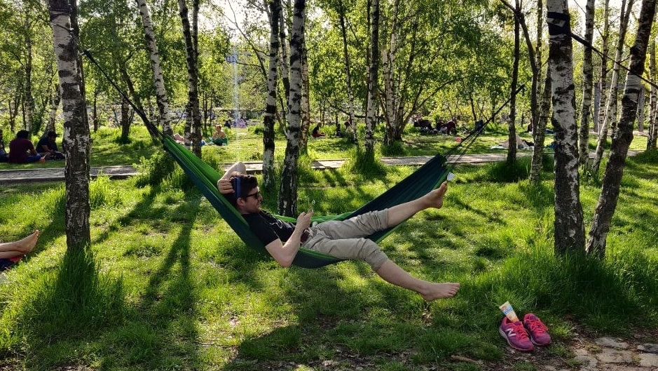
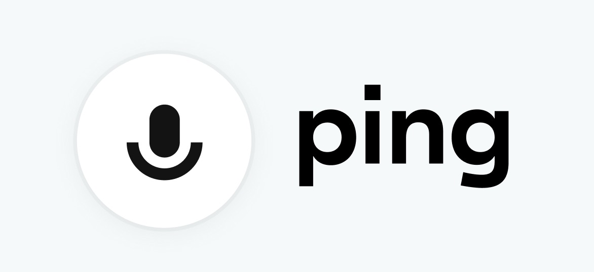

## Life

It finally feels like the summer has arrived ☀️

I just came back from the park, where, as you can see above, I was literally hanging out with friends. Oh how have I missed those gatherings. There's a lot of catching up to do and lots of planning of more (corona-friendly) activities. The hottest topic are still the corona vaccinations, how to get appointments for those and discussing the latest episode of [Coronavirus-Update](https://www.ndr.de/nachrichten/info/podcast4684.html). A German podcast featuring two leading virology professors.

## Blog

I unexpectedly found the time to write a blog post on [flexible color definitions in design systems](/flexible-color-definitions-in-design-systems) 🎨. It's a tiny thing that came up at work and I thought other people could benefit from it as well. It always takes me some time to get over the impostor syndrome when writing a blog post. I always think the post is not in-depth enough, or way too obvious so there would be no need to write about it. I am trying to get better at getting over that feeling and hope to write a couple more posts this year 📝

## Conference

Last year I did not attend a conference, not even an online one. Well, maybe I watched the keynote and a talk or two from last year's [Next.js Conf](https://nextjs.org/2020/conf) but that was it. No mingling with other people in break rooms, no sitting in a virtual audience.

It might have to do with the fact that the one conference that I attend each year got cancelled last year. This year however, [Web Audio Conference](https://www.webaudioconf2021.com) is definitely going to happen from July 5th to 7th 🎼. It will be fully virtual and I heard they will be using [Gather](https://gather.town/) as a virtual space. It looks pretty fun, I love the old-school RPG graphics ❤️

Previous editions of the Web Audio Conf also featured live performances an jam sessions. I'm curious to see if and how they are going to do this in the virtual environment.

## Side projects

### Ping

Preview of the _ping_ logo ❤️

I am easing back into working on _ping_ 🔈. It's always amazing when you come back to a project after a couple of months and it just works 🤩. As warm-up tasks I'm going to implement a couple basic components that are used on a couple of pages. Just to get back into the flow. The bigger chunky tasks I will tackle later. For now, it feels great to progress little by little. 😊

## Entertainment

[Last week](/weeknotes/2021/09/) I forgot to mention that I started watching [Schitt's Creek](https://en.wikipedia.org/wiki/Schitt%27s_Creek) and I'm totally obsessed with it. Season one started slow but after 4 episodes it got so much better. I highly, highly recommend the show!

## Song of the week

The weather makes me want to dance to happy Indie music, so this week I will end this post with **Go Out** by **KYTES** 🎸

<iframe width="100%" height="300" scrolling="no" frameborder="no" src="https://w.soundcloud.com/player/?url=https%3A//api.soundcloud.com/tracks/695907137&color=%23ff5500&auto_play=false&hide_related=false&show_comments=true&show_user=true&show_reposts=false&show_teaser=true&visual=true" loading="lazy"></iframe>
