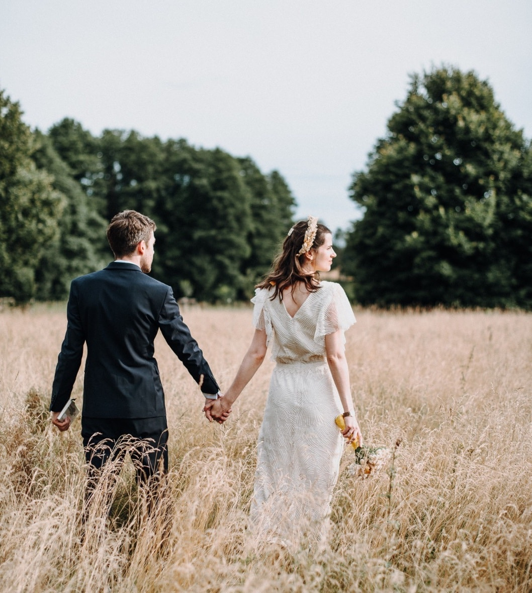

Wow, it's been a while. I basically skipped posting updates all summer long, whoops. Let me try to break down the most important events of the last months.

## Life

I got married!! Again! Let me explain 😅

My wife and I got officially married last year but due to covid restrictions we were only able to celebrate with witnesses and family. The big event we had been planning for a hear and a half had to be moved to a year later. Which was this summer. The new regulations allowed us to have around 70 guests. 80% of them were fully vaccinated and even though we legally did not have to, we asked everyone to get tested on the day and it all went well 🎉

We celebrated at a farm in the heart of Brandenburg which allowed us to have most of the celebration outside. Luckily the weather also played its part ☀️. It was such an amazing day with a ceremony full of surprises, outdoor games, seeing friends we hadn't seen in over a year, sitting at the fire until the early morning and a great veggie dinner. Everything we could have dreamed of. 😊

Due to some last minute DJ cancellations we played playlists throughout the day that I prepared the week before. In secret though, I also planned to play a DJ set. I had never played on the equipment they had at the venue and only had a couple minutes to get used to it. With some minor adjustments, I made the set work. My goal was to play a Berlin open air-style "house" set. The kind of music I missed the most during the pandemic when all festivals got cancelled.

I got the feeling that the crowd felt the vibe and went all-in into my mix of [funky](https://soundcloud.com/guesthousemusic/mark-funk-never-never) and [dreamy](https://soundcloud.com/andmeandyou/me-the-rapture-ptii) tracks. Multiple times in the set I had to join them on the dancefloor and get lost in the rhythm. Thanks again to my (former) colleagues Miguel and Julian for their help putting this together.

The set was not recorded because I'm a bloody amateur but I plan on recording it and I will post it here.

The rest of the summer we then spent at the French west coast on our honeymoon and then working remotely from Paris for a couple of weeks. Bordeaux and La Rochelle are such great places in the summer. The atlantic ocean then has the perfect temperature.

## Work

I have decided to leave SoundCloud. It was not an easy decisions but I felt that after almost seven years it was time for a change.

I've learned and grown so much at that company and am grateful for the time. My favorite people, the web collective, are such a great bunch of talented, smart and funny humans. I will miss them a lot 🥲. However, since I'm staying in Berlin, I know I will bump into them often.

I'm super excited to join Elastic as a software engineer on their [security product](https://www.elastic.co/security) in November. I have been interested in cyber security for a long time now and am happy to have gotten this opportunity to work in the field. Elastic has a small office in Berlin, but it's first and foremost a remote position. My team is spread evenely between Europe and the US but I don't think anybody else is working from Berlin. I'm curious to find out how it is to work for a company that has embraced remote working culture from the get-go. 🎉

## Entertainment

I spent the summer reading a bunch of Walter Tevis' novels. He's the author of Queen's Gambit which was made into a beautiful short series on Netflix just recently. Which is also what motivated me to look into Tevis.

I started with [The Man Who Fell To Earth](https://www.goodreads.com/book/show/396329.The_Man_Who_Fell_to_Earth) which is about an extraterrestrial being that comes to earth, impersonates as a human and ultimately suffers from the human condition. This book might seem like a science-fiction piece but is really more about society, capitalism and human psychology. Even though it was published in the 1960s it did not feel outdated and the parallels to current events surprised me.

I found the book of [The Queen's Gambit](https://www.goodreads.com/book/show/62022.The_Queen_s_Gambit) as great as the TV show. It made for a great read even though I still remembered the story by heart. It moved me as much as when I watched it on Netflix and it was fun to spot the tiny differences between the mini series and the book.

[The Hustler](https://www.goodreads.com/book/show/323170.The_Hustler) I finished whitin 3 days. It is a short one for sure but such a page-turner nonetheless. I loved the detailed descriptions of the poolrooms, the game, the deception, the intensity. For some reason it gave me some Hemingway vibes.

Oh yes, another highlight, but not a book, was to see [Dune](<https://en.wikipedia.org/wiki/Dune_(2021_film)>) in the cinema. I had not seen the previous movie, nor did I read the book before. Denis Villeneuve created something pretty spectacular and special. The atmosphere of the images and the great soundtrack by Hans Zimmer made me want to watch it again immediately. Can't wait to see the sequel and to read the books.

## Song of the week

I hope you'll love this neo-classic piece by ANIMAL FEELINGS as much as I did when I first heard it a couple months ago. It's perfect for the upcoming days of fall 🍂:

<iframe width="100%" height="300" scrolling="no" frameborder="no" src="https://w.soundcloud.com/player/?url=https%3A//api.soundcloud.com/tracks/859410541&color=%23ff5500&auto_play=false&hide_related=false&show_comments=true&show_user=true&show_reposts=false&show_teaser=true&visual=true" loading="lazy"></iframe>
